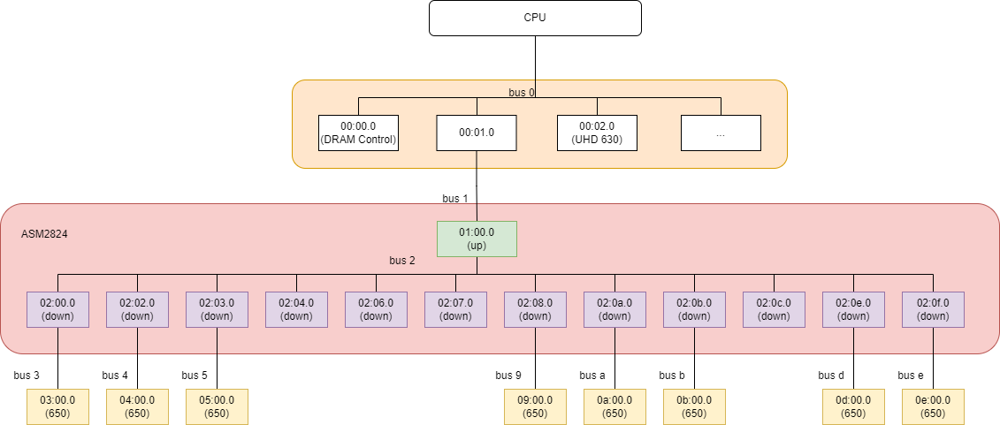
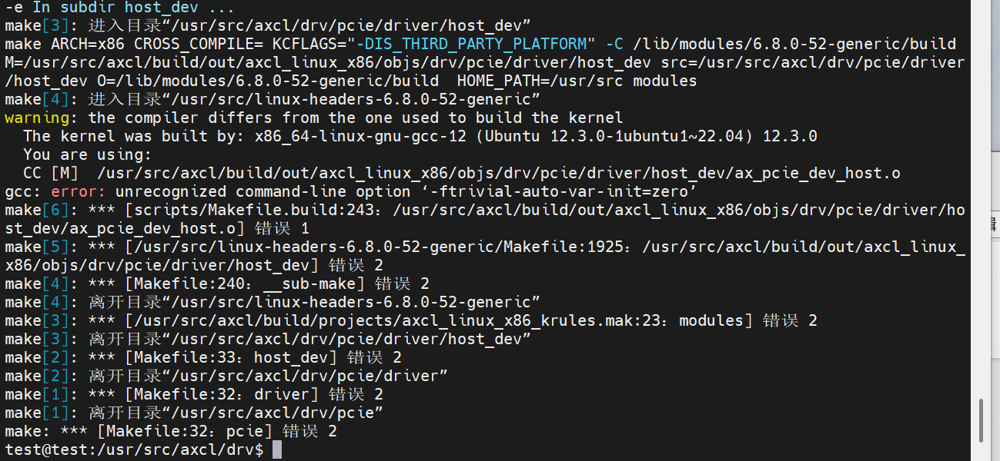

# 常见问题

## PCIe

### 理论带宽

AX650N 最大支持PCIe 2.0 x2。

| 版本 | 编码     | 传输速率  | X1           | X2         | X4      | X8      | X16     |
| ---- | -------- | --------- | ------------ | ---------- | ------- | ------- | ------- |
| 1.0  | 8/10b    | 2.5 GT/s  | 250 MB/s     | 500 MB/s   | 1 GB/s  | 2 GB/s  | 4 GB/s  |
| 2.0  | 8/10b    | 5.0 GT/s  | **500 MB/s** | **1 GB/s** | 2 GB/s  | 4 GB/s  | 8 GB/s  |
| 3.0  | 128/130b | 8.0 GT/s  | 1 GB/s       | 2 GB/s     | 4 GB/s  | 8 GB/s  | 16 GB/s |
| 4.0  | 128/130b | 16.0 GT/s | 2 GB/s       | 4 GB/s     | 8 GB/s  | 16 GB/s | 32 GB/s |
| 5.0  | 128/130b | 32.0 GT/s | 4 GB/s       | 8 GB/s     | 16 GB/s | 32 GB/s | 64 GB/s |


(faq_lspci_description)=
### 查询设备

**lspci**是一个用于Linux系统的命令行工具，它能够显示系统中所有PCI总线以及连接到这些总线的设备信息。通过 lspci ，用户可以获取设备的详细信息，包括设备的厂商ID、设备ID、设备类、设备驱动程序以及设备的配置空间信息等。

> AXERA PCIe Vendor ID： 0x1F4B， AX650默认的Device ID：0x0650

```bash
$ lspci
0000:01:00.0 Multimedia video controller: Axera Semiconductor Co., Ltd Device 0650 (rev 01)
```

::: {important}

若主控**lspci**无法找到EP设备，请确认：

1. 将EP设备连接到主控后重启主控。
2. 上述步骤仍然不能识别设备，可尝试更换PCIe插槽重启尝试，仍然无法识别，需要检查金手指以及联系硬件工程师排查（如测量PCIe时钟等）。

:::


#### 查询PCIe拓扑结构

```bash
$ lspci
00:00.0 Host bridge: Intel Corporation 8th Gen Core Processor Host Bridge/DRAM Registers (rev 07)
00:01.0 PCI bridge: Intel Corporation 6th-10th Gen Core Processor PCIe Controller (x16) (rev 07)
00:02.0 VGA compatible controller: Intel Corporation CoffeeLake-S GT2 [UHD Graphics 630]
01:00.0 PCI bridge: ASMedia Technology Inc. ASM2824 PCIe Gen3 Packet Switch (rev 01)
02:00.0 PCI bridge: ASMedia Technology Inc. ASM2824 PCIe Gen3 Packet Switch (rev 01)
02:02.0 PCI bridge: ASMedia Technology Inc. ASM2824 PCIe Gen3 Packet Switch (rev 01)
02:03.0 PCI bridge: ASMedia Technology Inc. ASM2824 PCIe Gen3 Packet Switch (rev 01)
02:04.0 PCI bridge: ASMedia Technology Inc. ASM2824 PCIe Gen3 Packet Switch (rev 01)
02:06.0 PCI bridge: ASMedia Technology Inc. ASM2824 PCIe Gen3 Packet Switch (rev 01)
02:07.0 PCI bridge: ASMedia Technology Inc. ASM2824 PCIe Gen3 Packet Switch (rev 01)
02:08.0 PCI bridge: ASMedia Technology Inc. ASM2824 PCIe Gen3 Packet Switch (rev 01)
02:0a.0 PCI bridge: ASMedia Technology Inc. ASM2824 PCIe Gen3 Packet Switch (rev 01)
02:0b.0 PCI bridge: ASMedia Technology Inc. ASM2824 PCIe Gen3 Packet Switch (rev 01)
02:0c.0 PCI bridge: ASMedia Technology Inc. ASM2824 PCIe Gen3 Packet Switch (rev 01)
02:0e.0 PCI bridge: ASMedia Technology Inc. ASM2824 PCIe Gen3 Packet Switch (rev 01)
02:0f.0 PCI bridge: ASMedia Technology Inc. ASM2824 PCIe Gen3 Packet Switch (rev 01)
03:00.0 Multimedia video controller: Axera Semiconductor Co., Ltd Device 0650 (rev 01)
04:00.0 Multimedia video controller: Axera Semiconductor Co., Ltd Device 0650 (rev 01)
05:00.0 Multimedia video controller: Axera Semiconductor Co., Ltd Device 0650 (rev 01)
09:00.0 Multimedia video controller: Axera Semiconductor Co., Ltd Device 0650 (rev 01)
0a:00.0 Multimedia video controller: Axera Semiconductor Co., Ltd Device 0650 (rev 01)
0b:00.0 Multimedia video controller: Axera Semiconductor Co., Ltd Device 0650 (rev 01)
0d:00.0 Multimedia video controller: Axera Semiconductor Co., Ltd Device 0650 (rev 01)
0e:00.0 Multimedia video controller: Axera Semiconductor Co., Ltd Device 0650 (rev 01)

$ lspci -vt
-[0000:00]-+-00.0  Intel Corporation 8th Gen Core Processor Host Bridge/DRAM Registers
           +-01.0-[01-0e]----00.0-[02-0e]--+-00.0-[03]----00.0  Axera Semiconductor Co., Ltd Device 0650
           |                               +-02.0-[04]----00.0  Axera Semiconductor Co., Ltd Device 0650
           |                               +-03.0-[05]----00.0  Axera Semiconductor Co., Ltd Device 0650
           |                               +-04.0-[06]--
           |                               +-06.0-[07]--
           |                               +-07.0-[08]--
           |                               +-08.0-[09]----00.0  Axera Semiconductor Co., Ltd Device 0650
           |                               +-0a.0-[0a]----00.0  Axera Semiconductor Co., Ltd Device 0650
           |                               +-0b.0-[0b]----00.0  Axera Semiconductor Co., Ltd Device 0650
           |                               +-0c.0-[0c]--
           |                               +-0e.0-[0d]----00.0  Axera Semiconductor Co., Ltd Device 0650
           |                               \-0f.0-[0e]----00.0  Axera Semiconductor Co., Ltd Device 0650
           +-02.0  Intel Corporation CoffeeLake-S GT2 [UHD Graphics 630]
```

如上所示：

> ` +-01.0-[01-0e]----00.0-[02-0e]-`

- `01.0`是一个PCI桥设备，[01 - 0e] 是01.0 PCI桥下面挂的PCI bus总线，其中01总线和00:01.0 设备相连接的总线
- 01总线下的设备01:00.0又是一个PCI桥设备，下面挂了 [02 - 0e] 总线，其中02总线和01:00.0 设备（ASM2824 up stream port) 相连接的总线
- 02总线下挂了03,04,05,06,07,08,09,0a,0b,0c,0d,0e总线，其中8条总线连接了AX650 EP，分别和ASM2824的down stream port连接。




#### 查询设备详细信息

```bash
$ sudo lspci -s 04:00.0 -vvv
04:00.0 Multimedia video controller: Axera Semiconductor Co., Ltd Device 0650 (rev 01)
        Subsystem: Axera Semiconductor Co., Ltd Device 0650
        Control: I/O- Mem+ BusMaster+ SpecCycle- MemWINV- VGASnoop- ParErr- Stepping- SERR- FastB2B- DisINTx+
        Status: Cap+ 66MHz- UDF- FastB2B- ParErr- DEVSEL=fast >TAbort- <TAbort- <MAbort- >SERR- <PERR- INTx-
        Latency: 0, Cache Line Size: 64 bytes
        Interrupt: pin A routed to IRQ 147
        Region 0: Memory at b6000000 (32-bit, prefetchable) [size=8M]
        Region 1: Memory at b6900000 (32-bit, prefetchable) [size=64K]
        Region 4: Memory at b6800000 (64-bit, prefetchable) [size=1M]
        Capabilities: [40] Power Management version 3
                Flags: PMEClk- DSI- D1+ D2- AuxCurrent=375mA PME(D0+,D1+,D2-,D3hot+,D3cold-)
                Status: D0 NoSoftRst+ PME-Enable- DSel=0 DScale=0 PME-
        Capabilities: [50] MSI: Enable+ Count=4/4 Maskable+ 64bit+
                Address: 00000000fee00618  Data: 0000
                Masking: 0000000e  Pending: 00000000
        Capabilities: [70] Express (v2) Endpoint, MSI 00
                DevCap: MaxPayload 128 bytes, PhantFunc 0, Latency L0s unlimited, L1 unlimited
                        ExtTag- AttnBtn- AttnInd- PwrInd- RBE+ FLReset- SlotPowerLimit 0.000W
                DevCtl: CorrErr+ NonFatalErr+ FatalErr+ UnsupReq+
                        RlxdOrd+ ExtTag- PhantFunc- AuxPwr- NoSnoop-
                        MaxPayload 128 bytes, MaxReadReq 512 bytes
                DevSta: CorrErr- NonFatalErr- FatalErr- UnsupReq- AuxPwr- TransPend-
                LnkCap: Port #0, Speed 5GT/s, Width x2, ASPM not supported
                        ClockPM- Surprise- LLActRep- BwNot- ASPMOptComp+
                LnkCtl: ASPM Disabled; RCB 64 bytes, Disabled- CommClk+
                        ExtSynch- ClockPM- AutWidDis- BWInt- AutBWInt-
                LnkSta: Speed 5GT/s (ok), Width x1 (downgraded)
                        TrErr- Train- SlotClk+ DLActive- BWMgmt- ABWMgmt-
                DevCap2: Completion Timeout: Not Supported, TimeoutDis+ NROPrPrP- LTR+
                         10BitTagComp- 10BitTagReq- OBFF Not Supported, ExtFmt- EETLPPrefix-
                         EmergencyPowerReduction Not Supported, EmergencyPowerReductionInit-
                         FRS- TPHComp- ExtTPHComp-
                         AtomicOpsCap: 32bit- 64bit- 128bitCAS-
                DevCtl2: Completion Timeout: 50us to 50ms, TimeoutDis- LTR+ OBFF Disabled,
                         AtomicOpsCtl: ReqEn-
                LnkCap2: Supported Link Speeds: 2.5-5GT/s, Crosslink- Retimer- 2Retimers- DRS-
                LnkCtl2: Target Link Speed: 5GT/s, EnterCompliance- SpeedDis-
                         Transmit Margin: Normal Operating Range, EnterModifiedCompliance- ComplianceSOS-
                         Compliance De-emphasis: -6dB
                LnkSta2: Current De-emphasis Level: -6dB, EqualizationComplete- EqualizationPhase1-
                         EqualizationPhase2- EqualizationPhase3- LinkEqualizationRequest-
                         Retimer- 2Retimers- CrosslinkRes: unsupported
        Capabilities: [100 v2] Advanced Error Reporting
                UESta:  DLP- SDES- TLP- FCP- CmpltTO- CmpltAbrt- UnxCmplt- RxOF- MalfTLP- ECRC- UnsupReq- ACSViol-
                UEMsk:  DLP- SDES- TLP- FCP- CmpltTO- CmpltAbrt- UnxCmplt- RxOF- MalfTLP- ECRC- UnsupReq- ACSViol-
                UESvrt: DLP+ SDES+ TLP- FCP+ CmpltTO- CmpltAbrt- UnxCmplt- RxOF+ MalfTLP+ ECRC- UnsupReq- ACSViol-
                CESta:  RxErr- BadTLP- BadDLLP- Rollover- Timeout- AdvNonFatalErr-
                CEMsk:  RxErr- BadTLP- BadDLLP- Rollover- Timeout- AdvNonFatalErr+
                AERCap: First Error Pointer: 00, ECRCGenCap+ ECRCGenEn- ECRCChkCap+ ECRCChkEn-
                        MultHdrRecCap- MultHdrRecEn- TLPPfxPres- HdrLogCap-
                HeaderLog: 00000000 00000000 00000000 00000000
        Capabilities: [148 v1] Latency Tolerance Reporting
                Max snoop latency: 71680ns
                Max no snoop latency: 71680ns
        Capabilities: [150 v1] L1 PM Substates
                L1SubCap: PCI-PM_L1.2+ PCI-PM_L1.1+ ASPM_L1.2+ ASPM_L1.1+ L1_PM_Substates+
                          PortCommonModeRestoreTime=55us PortTPowerOnTime=10us
                L1SubCtl1: PCI-PM_L1.2- PCI-PM_L1.1- ASPM_L1.2- ASPM_L1.1-
                           T_CommonMode=0us LTR1.2_Threshold=0ns
                L1SubCtl2: T_PwrOn=10us
        Capabilities: [160 v1] Vendor Specific Information: ID=0002 Rev=4 Len=100 <?>
        Capabilities: [260 v1] Vendor Specific Information: ID=0006 Rev=0 Len=018 <?>
        Capabilities: [278 v1] Physical Resizable BAR
                BAR 4: current size: 1MB, supported: 1MB
                BAR 5: current size: 1MB, supported: 1MB
        Capabilities: [2b8 v1] Virtual Resizable BAR
                BAR 4: current size: 8MB, supported: 1MB 2MB 4MB 8MB
        Kernel driver in use: ax_pcie_dev_host
        Kernel modules: ax_pcie_host_dev
```

其中比较关键的信息：

-  *Capabilities: [70] Express (v2) Endpoint, MSI 00*： 指明是EP设备，如果是上面拓扑的01:00.0设备，则显示*Upstream Port*，而02:00.0 - 02:0f.0则显示*Downstream port*。
- *LnkCap: Port #0, Speed 5GT/s, Width x2, ASPM not supported*：  设备能力是PCIe 2.0 x2，不支持ASPM，这个信息指示设备的能力，不代表实际协商的传输速率。
- *LnkSta: Speed 5GT/s (ok), Width x1 (downgraded)：*链路协商后的速率是PCIe 2.0 x1，即实际传输的速率。
- Bar 信息
  - *Region 0: Memory at b6000000 (32-bit, prefetchable) [size=8M]*
  - *Region 1: Memory at b6900000 (32-bit, prefetchable) [size=64K]*
  - *Region 4: Memory at b6800000 (64-bit, prefetchable) [size=1M]*
- *CESta:  RxErr- BadTLP- BadDLLP- Rollover- Timeout- AdvNonFatalErr-*： 链路传输状态，当该状态异常(+) 时，优先考虑信号质量和时钟。


#### 查询配置空间寄存器

```bash
$ sudo lspci -s 04:00.0 -xxx
04:00.0 Multimedia video controller: Axera Semiconductor Co., Ltd Device 0650 (rev 01)
00: 4b 1f 50 06 06 04 11 00 01 00 00 04 10 00 00 00
10: 08 00 00 b6 08 00 90 b6 00 00 00 00 00 00 00 00
20: 0c 00 80 b6 00 00 00 00 00 00 00 00 4b 1f 50 06
30: 00 00 00 00 40 00 00 00 00 00 00 00 0b 01 00 00
40: 01 50 d3 5b 08 00 00 00 00 00 00 00 00 00 00 00
50: 05 70 a5 03 18 06 e0 fe 00 00 00 00 00 00 00 00
60: 0e 00 00 00 00 00 00 00 00 00 00 00 00 00 00 00
70: 10 00 02 00 c0 8f 00 00 1f 20 00 00 22 c0 40 00
80: 40 00 12 10 00 00 00 00 00 00 00 00 00 00 00 00
90: 00 00 00 00 10 08 00 00 00 04 00 00 06 00 00 00
a0: 02 00 00 00 00 00 00 00 00 00 00 00 00 00 00 00
b0: 00 00 00 00 00 00 00 00 00 00 00 00 00 00 00 00
c0: 00 00 00 00 00 00 00 00 00 00 00 00 00 00 00 00
d0: 00 00 00 00 00 00 00 00 00 00 00 00 00 00 00 00
e0: 00 00 00 00 00 00 00 00 00 00 00 00 00 00 00 00
f0: 00 00 00 00 00 00 00 00 00 00 00 00 00 00 00 00
```


(faq-comm-fatal)=
### 通信异常

如果主控和PCIe设备通信异常，比如：

```bash
[2025-06-06 09:43:55.891][8779][E][channel][send][166]: send 2807 bytes, but 0 bytes sent
[2025-06-06 09:43:55.891][8804][E][pcie][send_data_by_dma][341]: [1-21] recv dma size 614400 is not equal to 9743
[2025-06-06 09:43:55.891][8804][E][channel][send][166]: send 9743 bytes, but 0 bytes sent
```

如果发生通信异常，建议按照如下步骤排查是否PCIe设备异常导致的通信异常：

1. 检查主控的dmesg日志，查看是否有设备`dead`日志，比如：` [heartbeat_recv_thread, 578]: device 4: dead!`。

2. `sudo lspci -s BDF -vvv` 查看PCIe链路是否断开，如下所示Region 0、Region 1和Region 4的状态是**[virtual]**

   ```bash
   $ sudo lspci -s 03:00.0 -vvv
   03:00.0 Multimedia video controller: Axera Semiconductor Co., Ltd Device 0650 (rev 01)
           Subsystem: Axera Semiconductor Co., Ltd Device 0650
           Control: I/O- Mem- BusMaster- SpecCycle- MemWINV- VGASnoop- ParErr- Stepping- SERR- FastB2B- DisINTx-
           Status: Cap+ 66MHz- UDF- FastB2B- ParErr- DEVSEL=fast >TAbort- <TAbort- <MAbort- >SERR- <PERR- INTx-
           Interrupt: pin A routed to IRQ 87
           NUMA node: 0
           Region 0: Memory at e0800000 (32-bit, non-prefetchable) [virtual] [size=8M]
           Region 1: Memory at e1100000 (32-bit, non-prefetchable) [virtual] [size=64K]
           Region 4: Memory at e1000000 (64-bit, non-prefetchable) [virtual] [size=1M]
   ```

| 设备无心跳 dead | PCIe链路断开 | 可能的原因                                                   | 解决方法         |
| --------------- | ------------ | ------------------------------------------------------------ | ---------------- |
| ✅               |              | -  设备核心应用(slave_daemon) 崩溃（比如coredump）           | 子卡接入串口分析 |
| ✅               | ✅            | - 主控系统休眠<br />- PCIe switch或者EP过温<br />- 设备系统崩溃（panic) | 下面章节描述     |


#### 主控系统休眠

AX650N不支持ASPM，因此**HOST需要关闭休眠**功能，否则会导致设备掉卡。

从主控dmesg的日志中可以看到系统进入了休眠模式。

```bash
[ 2065.530453] [heartbeat_recv_thread, 578]: device 4: dead!
[ 2086.012066] [heartbeat_recv_thread, 578]: device 4: dead!
[ 2103.682752] PM: suspend entry (deep)
[ 2106.493464] [heartbeat_recv_thread, 578]: device 4: dead!
[ 2108.440554] Filesystems sync: 4.757 seconds
[ 2109.226893] Freezing user space processes
[ 2109.228564] Freezing user space processes completed (elapsed 0.001 seconds)
[ 2109.228567] OOM killer disabled.
[ 2109.228567] Freezing remaining freezable tasks
[ 2109.229577] Freezing remaining freezable tasks completed (elapsed 0.001 seconds)
[ 2109.229616] printk: Suspending console(s) (use no_console_suspend to debug)
[ 2109.231782] serial 00:02: disabled
[ 2109.231849] e1000e: EEE TX LPI TIMER: 00000011
[ 2109.257414] sd 2:0:0:0: [sda] Synchronizing SCSI cache
[ 2109.259622] ata3.00: Entering standby power mode
[ 2109.681897] ACPI: PM: Preparing to enter system sleep state S3
[ 2110.922369] ACPI: PM: Saving platform NVS memory
[ 2110.922403] Disabling non-boot CPUs ...
[ 2110.923601] smpboot: CPU 1 is now offline
[ 2110.925061] smpboot: CPU 2 is now offline
[ 2110.926414] smpboot: CPU 3 is now offline
[ 2110.927791] smpboot: CPU 4 is now offline
[ 2110.929131] smpboot: CPU 5 is now offline
```


#### 过温

AX650 设备硬件复位温度阈值是Tj **120**度，当工作温度超过设备或switch的Tj复位温度，都会导致复位掉卡。

::: {note}

PCIe板卡通常会用switch芯片进行多个EP设备桥接，如果PCIe板卡被动散热硬件设计不良，且超过了switch芯片结温Tj，也会导致板卡整体复位。

请查阅switch芯片文档了解switch芯片的工作结温Tj。

:::


#### 系统崩溃

参阅[sysdump章节](#faq-sysdump)抓取sysdump提供研发工程师分析。


### 中断

- HOST 通知 设备（EP）在协议上没有规定，AX650N方案中使用EP的mailbox中断（BAR1 inbound）

- 设备（EP）通知 HOST，使用标准 MSI 中断，AX650N不支持MSI-X中断。

  ```bash
  $ cat /proc/interrupts | grep MSI
   143:          0         75          0          0          0          0  IR-PCI-MSI-0000:03:00.0    0-edge      0000:03:00.0
   147:          0          0         70          0          0          0  IR-PCI-MSI-0000:04:00.0    0-edge      0000:04:00.0
   151:          0          0          0          0          0         70  IR-PCI-MSI-0000:05:00.0    0-edge      0000:05:00.0
   155:         70          0          0          0          0          0  IR-PCI-MSI-0000:09:00.0    0-edge      0000:09:00.0
   159:          0         70          0          0          0          0  IR-PCI-MSI-0000:0a:00.0    0-edge      0000:0a:00.0
   163:          0          0         70          0          0          0  IR-PCI-MSI-0000:0b:00.0    0-edge      0000:0b:00.0
   167:          0          0          0         70          0          0  IR-PCI-MSI-0000:0d:00.0    0-edge      0000:0d:00.0
   171:          0          0          0          0         70          0  IR-PCI-MSI-0000:0e:00.0    0-edge      0000:0e:00.0
  ```


## 驱动安装

(ftrivial-auto-var-init=zero)=
### -ftrivial-auto-var-init=zero



`gcc -v`和`cat /proc/version`查看当前系统内核所用的gcc版本不一致：

```bash
$ gcc -v
Using built-in specs.
COLLECT_GCC=gcc
... ...
gcc version 11.4.0 (Ubuntu 11.4.0-1ubuntu1~22.04)

$ cat /proc/version
Linux version 6.8.0-57-generic (buildd@lcy02-amd64-104) (x86_64-linux-gnu-gcc-12 (Ubuntu 12.3.0-1ubuntu1~22.04) 12.3.0, GNU ld (GNU Binutils for Ubuntu) 2.38) #59~22.04.1-Ubuntu SMP PREEMPT_DYNAMIC Wed Mar 19 17:07:41 UTC 2
```

升级到内核gcc-12解决

```bash
$ apt install gcc-12
$ sudo update-alternatives --install /usr/bin/gcc gcc /usr/bin/gcc-12 12
```


(gccupdate)=
### gcc更新

AXCL运行时刻采用C++17标准，因此GCC要求最低为[9.4.0](https://ftp.gnu.org/gnu/gcc/gcc-9.4.0/gcc-9.4.0.tar.gz)，以下章节以[UOS 1070 HWE操作系统](https://www.chinauos.com/resource/download-professional)为例描述如何离线编译和安装gcc 9.4.0。

:::{note}
为避免污染root环境，请以user账户操作。
:::

**Step1:  安装依赖**

```bash
$ sudo apt update
$ sudo apt install -y build-essential wget gcc make gawk bison flex libgmp-dev libmpfr-dev libmpc-dev libz-dev
```

**Step2：下载gcc源码**

```bash
$ wget https://ftp.gnu.org/gnu/gcc/gcc-9.4.0/gcc-9.4.0.tar.gz
$ tar -xvf gcc-9.4.0.tar.gz
$ cd gcc-9.4.0
```

**Step3：下载依赖库**

运行脚本自动下载依赖（isl、cloog等），此过程依赖网络速度，请耐心等待完成。

```bash
$ ./contrib/download_prerequisites
```

**Step4：配置编译选项**

```bash
$ mkdir build && cd build
$ ../configure --prefix=/usr/local/gcc-9.4.0 --enable-threads=posix --disable-checking  --disable-multilib
```

- `--prefix`：指定安装路径（默认为`/usr/local`）。
- `--disable-multilib`：禁用多库支持（如仅需64位）

**Step5：编译与安装**

```bash
$ make -j$(nproc)
$ sudo make install
```

**Step6：配置环境变量**

```bash
$ echo 'export PATH=/usr/local/gcc-9.4.0/bin:$PATH' >> ~/.bashrc
$ echo 'export LD_LIBRARY_PATH=/usr/local/gcc-9.4.0/lib64:$LD_LIBRARY_PATH' >> ~/.bashrc
$ source ~/.bashrc
```

**Step7：验证安装**

```bash
$ gcc -v  # 应显示 "gcc (GCC) 9.4.0"
```


## 维测日志

### 设备日志

[**axcl-smi**](#doc-axcl-smi) 工具支持将设备侧的日志（内核、syslog和runtime log）抓取到HOST本地，使用方法如下：

```bash
$ axcl-smi --help
usage: axcl-smi [<command> [<args>]] [--device] [--version] [--help]
Commands
    log                                     Dump logs from device
        -t[mask], --type=[mask]                 Specifies which logs to dump by a combination (bitwise OR) value of blow:
                                                  -1: all (default) 0x01: daemon 0x02: worker 0x10: syslog 0x20: kernel
        -o[path], --output=[path]               Specifies the path to save dump logs (default: ./)
-d, --device                            Card index [0, connected cards number - 1]
-h, --help                              Show this help menu
```

如下示例所示，抓取#device 0的日志：

```bash
$ axcl-smi log -d 0
[2025-05-19 18:54:58.252][687704][C][log][dump][73]: log dump finished: ./dev3_log_20250519185454.tar.gz
```


(faq-sysdump)=
### sysdump

当[设备系统崩溃(panic)](#faq-comm-fatal)时，HOST 驱动支持dump设备侧DDR用于调试分析。在HOST `/proc/ax_proc/pcie/sysdump`提供如下节点控制和配置sysdump，分别是

| #    | 节点                             | 默认值     | 说明                                                         |
| ---- | -------------------------------- | ---------- | ------------------------------------------------------------ |
| 1    | /proc/ax_proc/pcie/sysdump/debug | 0          | 1：使能sysdump  0: 不使能<br />`echo 1 > /proc/ax_proc/pcie/sysdump/debug` |
| 2    | /proc/ax_proc/pcie/sysdump/path  | /opt       | 指定存放dump文件路径<br />`echo -n /mnt > /proc/ax_proc/pcie/sysdump/path`<br /> **-n** : 去除echo自动带的 `/n`；<br />保证路径目录有足够大的空间存储 dump 文件，否则部分数据丢失) |
| 3    | /proc/ax_proc/pcie/sysdump/size  | 1073741824 | 指定dump的DDR大小，默认1GB。size为10进制，**不推荐修改**。   |


#### 操作步骤

> [操作视频](https://github.com/AXERA-TECH/axcl-docs/tree/main/res/sysdump.mp4)

1. 保持设备状态不掉电，强杀（如：`killall -9`）主控应用进程。
2. `sudo su` 切换到root用户。
3. 手动卸载主控 **axcl_host** 驱动： `modprobe -r axcl_host` 或 `rmmod axcl_host`
4. 使能sysdump，配置dump路径：

```bash
$ echo 1 > /proc/ax_proc/pcie/sysdump/debug
$ echo -n /mnt > /proc/ax_proc/pcie/sysdump/path
```

5. 重新加载主控 **axcl_host** 驱动： `modprobe axcl_host` 或 `insmod axcl_host.ko` 驱动加载过程中，自动开始dump panic的设备，并重新加载设备固件。
6. 将sysdump文件和**该固件版本对应的vmlinux文件**提供给技术支持工

:::{important}

- 以上操作卸载驱动，会**复位所有设备**，并且驱动会拉启所有设备，并dump 有异常的设备。

- 如果在业务执行过程中，某个设备异常重启了，如只需dump 异常设备数据，需要在应用代码中(`axclrtRebootDevice`) 启动指定异常设备，这个过程只会单独dump这张异常设备数据，不会影响其它正常设备的运行。

- 应用代码调用`axclrtRebootDevice`也需要配置`/proc/ax_proc/pcie/sysdump`。

- 时间戳：在 sysdump 后，sysdump 文件名时间戳可能不对，需要进行以下设置（**此步骤不影响dump的数据内容，非必须**）:

  - 确认 RTC 是否设置为本地时区：

    使用以下命令检查 RTC 是否设置为本地时区：`timedatectl | grep RTC`

  - 将 RTC 设置为本地时区：

    使用以下命令将 RTC 设置为本地时区：`sudo timedatectl set-local-rtc 1`

  - 同步系统时间到 RTC：

    如果需要，您可以将系统时间同步到 RTC：`sudo hwclock --systohc`

:::


### 设备信息

(faq_device_ddr_bw)=

#### DDR带宽

SDK V3.6.1（含）后续版本支持通过axcl-smi抓取设备DDR带宽，操作步骤如下：

```bash
$ axcl-smi sh "insmod /soc/ko/ax_perf_monitor.ko && sleep 1 && cat /proc/ax_proc/bw/bw && rmmod ax_perf_monitor" -d 0
```


(faq_device_npu_tilization)=

#### NPU利用率

- **axcl-smi** 可以查询NPU的平均利用率

- 如需要获取更详细的npu各个核的利用率，操作步骤如下：

  ```bash
  $ axcl-smi sh "cat /proc/ax_proc/npu/top" -d 0
  $ axcl-smi sh "cat /proc/ax_proc/npu/top_sum" -d 0
  ```

:::{note}

  如果NPU空闲状态，设备将返回 `nputop info is empty!` 或者 `nputop info not updated over xxx ms!`

:::


(faq_axcl_json)=
### axcl.json

AXCL 提供`axcl.json` 文件调整日志级别，DMA传输缓存大小等，格式如下：

```json
{
	"log": {
		"host": {
			"path": "/tmp/axcl/axcl_logs.txt",
			"//   ": "0: trace, 1: debug, 2: info, 3: warn, 4: error, 5: critical, 6: off",
			"level": 2
		},
		"device": {
			"//   ": "0: trace, 1: debug, 2: info, 3: warn, 4: error, 5: critical, 6: off",
			"level": 2
		}
	},
    "dma buf size": "0x400000"
}
```

| 关键字        | 默认值                   | 说明                                                          |
| ------------ | ----------------------- | ------------------------------------------------------------ |
| path         | /tmp/axcl/axcl_logs.txt | HOST runtime日志文件路径                                       |
| level        | 2 (info)                | 日志级别                                                      |
| dma buf size | "0x400000"              | DMA传输缓存大小，默认4MBytes。SDK DMA传输缓存总大小 = *dma buf size x 2* |

