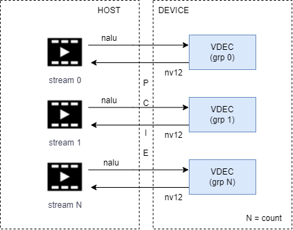

# SDK Samples

## runtime

### axcl_sample_runtime

Sample to invoke runtime APIs.

```
1. Initialize runtime by `axclInit`.
2. Active device by `axclrtSetDevice`.
3. Create context by `axclrtCreateDevice` for main thread (optional).
4. Create and destory thread context (must).
5. Destory context of main thread.
6. Deactive device by `axclrtResetDevice`.
7. Deinitialize runtime by `axclFinalize`.
```


#### usage

```bash
$ axcl_sampe_runtime --help
usage: ./axcl_sample_runtime [options] ...
options:
  -d, --device    device index [-1, connected device num - 1], -1: traverse all devices (int [=-1])
      --json      axcl.json path (string [=./axcl.json])
      --reboot    reboot device
  -?, --help      print this message
```

| Args         | Default Value                                 | Description                                          |
| ------------ | --------------------------------------------- | ---------------------------------------------------- |
| -d, --device | -1,  range: [-1, 0 - connected device num -1] | Specifies the device index. -1: traverse all devices |
| --json       | [axcl.json](#faq_axcl_json) file path         |                                                      |
| --reboot     | NA                                            | Panic device and reboot.                             |


#### example1

Query the properties from device #0.

```bash
$ axcl_sample_runtime -d 0
[INFO ][                            main][  36]: ============== V3.5.0_20250515190238 sample started May 15 2025 19:29:09 =============
json file
[INFO ][                      operator()][ 130]: [0000:03.0] software version: Ax_Version V3.5.0_20250515190238
[INFO ][                      operator()][ 131]: [0000:03.0] uid             : 0x6010b819428590c6
[INFO ][                      operator()][ 132]: [0000:03.0] temperature     : 80000
[INFO ][                      operator()][ 133]: [0000:03.0] total mem size  : 968356   KB
[INFO ][                      operator()][ 134]: [0000:03.0] free  mem size  : 814932   KB
[INFO ][                      operator()][ 135]: [0000:03.0] total cmm size  : 7208960  KB
[INFO ][                      operator()][ 136]: [0000:03.0] free  cmm size  : 7190084  KB
[INFO ][                      operator()][ 137]: [0000:03.0] avg cpu loading : 2.3%
[INFO ][                      operator()][ 138]: [0000:03.0] avg npu loading : 0.0%
[INFO ][                      operator()][ 149]: malloc 1048576 bytes memory from device  3 success, addr = 0x14926f000
[INFO ][                            main][ 215]: ============== V3.5.0_20250515190238 sample exited May 15 2025 19:29:09 ==============
```


#### example2

Manually panic device #0 by sending `echo c > /proc/sysrq-trigger`, then reboot and download firmware again.

```bash
$ axcl_sample_runtime -d 0 --reboot
[INFO ][                            main][  36]: ============== V3.5.0_20250515190238 sample started May 15 2025 19:29:09 =============
json file
[INFO ][                      operator()][ 130]: [0000:03.0] software version: Ax_Version V3.5.0_20250515190238
[INFO ][                      operator()][ 131]: [0000:03.0] uid             : 0x6010b819428590c6
[INFO ][                      operator()][ 132]: [0000:03.0] temperature     : 80294
[INFO ][                      operator()][ 133]: [0000:03.0] total mem size  : 968356   KB
[INFO ][                      operator()][ 134]: [0000:03.0] free  mem size  : 814840   KB
[INFO ][                      operator()][ 135]: [0000:03.0] total cmm size  : 7208960  KB
[INFO ][                      operator()][ 136]: [0000:03.0] free  cmm size  : 7190084  KB
[INFO ][                      operator()][ 137]: [0000:03.0] avg cpu loading : 1.2%
[INFO ][                      operator()][ 138]: [0000:03.0] avg npu loading : 0.0%
[INFO ][                      operator()][ 149]: malloc 1048576 bytes memory from device  3 success, addr = 0x14926f000
[INFO ][                            main][ 178]: panic device 0x3
[INFO ][                            main][ 185]: wait for device 0x3 to reboot in 60 seconds
[2025-05-20 19:16:08.784][33219][W][device manager][listen][292]: device 3 is dead
[INFO ][          device_status_callback][  28]: device 0x3 is offline, rebooting ...
[INFO ][          device_status_callback][  31]: device 0x3 is online, reboot success
[INFO ][                            main][ 200]: check connection of device 0x3 success
[INFO ][                            main][ 215]: ============== V3.5.0_20250515190238 sample exited May 15 2025 19:29:09 ==============
```


### axcl_sample_memory

Sample for memory copy between HOST and devcie.

```
         HOST          |               DEVICE
      host_mem[0] -----------> dev_mem[0]
                                    |---------> dev_mem[1]
      host_mem[1] <----------------------------------|

1. allocate host_mem[2] by `axclrtMallocHost` and dev_mem[2] by `axclrtMalloc`.
2. axclrtMemcpy(dev_mem[0], host_mem[0], size, AXCL_MEMCPY_HOST_TO_DEVICE)
3. axclrtMemcpy(dev_mem[1], dev_mem[0], size, AXCL_MEMCPY_DEVICE_TO_DEVICE)
4. axclrtMemcpy(host_mem[1], dev_mem[1], size, AXCL_MEMCPY_DEVICE_TO_HOST)
5. memcmp(host_mem[0], host_mem[1], size)
```


#### usage

```bash
$ axcl_sample_memory --help
usage: ./axcl_sample_memory [options] ...
options:
  -d, --device    device index from 0 to connected device num - 1 (int [=0])
      --json      axcl.json path (string [=./axcl.json])
  -?, --help      print this message
```

| Args         | Default Value                            | Description                |
| ------------ | ---------------------------------------- | -------------------------- |
| -d, --device | 0,  range: [0 - connected device num -1] | Specifies the device index |
| --json       | [axcl.json](#faq_axcl_json) file path    |                            |


#### example

```bash
$ axcl_sample_memory  -d 0
[INFO ][                            main][  32]: ============== V3.5.0_20250515190238 sample started May 15 2025 19:29:10 ==============
[INFO ][                           setup][ 112]: json: ./axcl.json
json file
[INFO ][                           setup][ 131]: device index: 0, bus number: 3
[INFO ][                            main][  51]: alloc host and device memory, size: 0x800000
[INFO ][                            main][  63]: memory [0]: host 0x7fc451ffc010, device 0x14926f000
[INFO ][                            main][  63]: memory [1]: host 0x7fc4517fb010, device 0x149a6f000
[INFO ][                            main][  69]: memcpy from host memory[0] 0x7fc451ffc010 to device memory[0] 0x14926f000
[INFO ][                            main][  75]: memcpy device memory[0] 0x14926f000 to device memory[1] 0x149a6f000
[INFO ][                            main][  81]: memcpy device memory[1] 0x149a6f000 to host memory[0] 0x7fc4517fb010
[INFO ][                            main][  88]: compare host memory[0] 0x7fc451ffc010 and host memory[1] 0x7fc4517fb010 success
[INFO ][                         cleanup][ 146]: deactive device 3 and cleanup axcl
[INFO ][                            main][ 106]: ============== V3.5.0_20250515190238 sample exited May 15 2025 19:29:10 ==============
```


## native

### axcl_sample_sys

Sample for the usage native **SYS** module including:

- non-cached CMM memory allocation and release.
- cached CMM memory allocation and release.
- common memory pool allocation and release.
- private memory pool allocation and release.
- module link and query.


#### usage

```bash
$ axcl_sample_sys --help
usage: axcl_sample_sys [options] ...
options:
  -d, --device    device index from 0 to connected device num - 1 (unsigned int [=0])
      --json      axcl.json path (string [=./axcl.json])
  -?, --help      print this message
```

| Args         | Default Value                            | Description                |
| ------------ | ---------------------------------------- | -------------------------- |
| -d, --device | 0,  range: [0 - connected device num -1] | Specifies the device index |
| --json       | [axcl.json](#faq_axcl_json) file path    |                            |


#### example

```bash
$ ./axcl_sample_sys -d 0
[INFO ][                            main][  35]: json: ./axcl.json
json file
[INFO ][                            main][  55]: device index: 0, bus number: 3
[INFO ][           sample_sys_alloc_free][  82]: sys_alloc_free begin
[INFO ][           sample_sys_alloc_free][  91]: alloc PhyAddr= 0x14926f000,pVirAddr=0xffff9aace000
[INFO ][           sample_sys_alloc_free][  91]: alloc PhyAddr= 0x14936f000,pVirAddr=0xffff9a9ce000
[INFO ][           sample_sys_alloc_free][  91]: alloc PhyAddr= 0x14946f000,pVirAddr=0xffff9a8ce000
[INFO ][           sample_sys_alloc_free][  91]: alloc PhyAddr= 0x14956f000,pVirAddr=0xffff9a7ce000
[INFO ][           sample_sys_alloc_free][  91]: alloc PhyAddr= 0x14966f000,pVirAddr=0xffff9a6ce000
[INFO ][           sample_sys_alloc_free][  91]: alloc PhyAddr= 0x14976f000,pVirAddr=0xffff9a5ce000
[INFO ][           sample_sys_alloc_free][  91]: alloc PhyAddr= 0x14986f000,pVirAddr=0xffff9a4ce000
[INFO ][           sample_sys_alloc_free][  91]: alloc PhyAddr= 0x14996f000,pVirAddr=0xffff9a3ce000
[INFO ][           sample_sys_alloc_free][  91]: alloc PhyAddr= 0x149a6f000,pVirAddr=0xffff9a2ce000
[INFO ][           sample_sys_alloc_free][  91]: alloc PhyAddr= 0x149b6f000,pVirAddr=0xffff9a1ce000
[INFO ][           sample_sys_alloc_free][ 100]: free PhyAddr= 0x14926f000,pVirAddr=0xffff9aace000
[INFO ][           sample_sys_alloc_free][ 100]: free PhyAddr= 0x14936f000,pVirAddr=0xffff9a9ce000
[INFO ][           sample_sys_alloc_free][ 100]: free PhyAddr= 0x14946f000,pVirAddr=0xffff9a8ce000
[INFO ][           sample_sys_alloc_free][ 100]: free PhyAddr= 0x14956f000,pVirAddr=0xffff9a7ce000
[INFO ][           sample_sys_alloc_free][ 100]: free PhyAddr= 0x14966f000,pVirAddr=0xffff9a6ce000
[INFO ][           sample_sys_alloc_free][ 100]: free PhyAddr= 0x14976f000,pVirAddr=0xffff9a5ce000
[INFO ][           sample_sys_alloc_free][ 100]: free PhyAddr= 0x14986f000,pVirAddr=0xffff9a4ce000
[INFO ][           sample_sys_alloc_free][ 100]: free PhyAddr= 0x14996f000,pVirAddr=0xffff9a3ce000
[INFO ][           sample_sys_alloc_free][ 100]: free PhyAddr= 0x149a6f000,pVirAddr=0xffff9a2ce000
[INFO ][           sample_sys_alloc_free][ 100]: free PhyAddr= 0x149b6f000,pVirAddr=0xffff9a1ce000
[INFO ][           sample_sys_alloc_free][ 103]: sys_alloc_free end success
[INFO ][     sample_sys_alloc_cache_free][ 115]: sys_alloc_cache_free begin
[INFO ][     sample_sys_alloc_cache_free][ 124]: alloc PhyAddr= 0x14926f000,pVirAddr=0xffff9aace000
[INFO ][     sample_sys_alloc_cache_free][ 124]: alloc PhyAddr= 0x14936f000,pVirAddr=0xffff9a9ce000
[INFO ][     sample_sys_alloc_cache_free][ 124]: alloc PhyAddr= 0x14946f000,pVirAddr=0xffff9a8ce000
[INFO ][     sample_sys_alloc_cache_free][ 124]: alloc PhyAddr= 0x14956f000,pVirAddr=0xffff9a7ce000
[INFO ][     sample_sys_alloc_cache_free][ 124]: alloc PhyAddr= 0x14966f000,pVirAddr=0xffff9a6ce000
[INFO ][     sample_sys_alloc_cache_free][ 124]: alloc PhyAddr= 0x14976f000,pVirAddr=0xffff9a5ce000
[INFO ][     sample_sys_alloc_cache_free][ 124]: alloc PhyAddr= 0x14986f000,pVirAddr=0xffff9a4ce000
[INFO ][     sample_sys_alloc_cache_free][ 124]: alloc PhyAddr= 0x14996f000,pVirAddr=0xffff9a3ce000
[INFO ][     sample_sys_alloc_cache_free][ 124]: alloc PhyAddr= 0x149a6f000,pVirAddr=0xffff9a2ce000
[INFO ][     sample_sys_alloc_cache_free][ 124]: alloc PhyAddr= 0x149b6f000,pVirAddr=0xffff9a1ce000
[INFO ][     sample_sys_alloc_cache_free][ 133]: free PhyAddr= 0x14926f000,pVirAddr=0xffff9aace000
[INFO ][     sample_sys_alloc_cache_free][ 133]: free PhyAddr= 0x14936f000,pVirAddr=0xffff9a9ce000
[INFO ][     sample_sys_alloc_cache_free][ 133]: free PhyAddr= 0x14946f000,pVirAddr=0xffff9a8ce000
[INFO ][     sample_sys_alloc_cache_free][ 133]: free PhyAddr= 0x14956f000,pVirAddr=0xffff9a7ce000
[INFO ][     sample_sys_alloc_cache_free][ 133]: free PhyAddr= 0x14966f000,pVirAddr=0xffff9a6ce000
[INFO ][     sample_sys_alloc_cache_free][ 133]: free PhyAddr= 0x14976f000,pVirAddr=0xffff9a5ce000
[INFO ][     sample_sys_alloc_cache_free][ 133]: free PhyAddr= 0x14986f000,pVirAddr=0xffff9a4ce000
[INFO ][     sample_sys_alloc_cache_free][ 133]: free PhyAddr= 0x14996f000,pVirAddr=0xffff9a3ce000
[INFO ][     sample_sys_alloc_cache_free][ 133]: free PhyAddr= 0x149a6f000,pVirAddr=0xffff9a2ce000
[INFO ][     sample_sys_alloc_cache_free][ 133]: free PhyAddr= 0x149b6f000,pVirAddr=0xffff9a1ce000
[INFO ][     sample_sys_alloc_cache_free][ 136]: sys_alloc_cache_free end success
[INFO ][          sample_sys_commom_pool][ 148]: sys_commom_pool begin
[INFO ][          sample_sys_commom_pool][ 157]: AXCL_SYS_Init success!
[INFO ][          sample_sys_commom_pool][ 167]: AXCL_POOL_Exit success!
[INFO ][          sample_sys_commom_pool][ 199]: AXCL_POOL_SetConfig success!
[INFO ][          sample_sys_commom_pool][ 208]: AXCL_POOL_Init success!
[INFO ][          sample_sys_commom_pool][ 222]: AXCL_POOL_GetBlock success!BlkId:0x5E002000
[INFO ][          sample_sys_commom_pool][ 233]: AXCL_POOL_Handle2PoolId success!(Blockid:0x5E002000 --> PoolId=2)
[INFO ][          sample_sys_commom_pool][ 244]: AXCL_POOL_Handle2PhysAddr success!(Blockid:0x5E002000 --> PhyAddr=0x14ad8d000)
[INFO ][          sample_sys_commom_pool][ 255]: AXCL_POOL_Handle2MetaPhysAddr success!(Blockid:0x5E002000 --> MetaPhyAddr=0x14a18b000)
[INFO ][          sample_sys_commom_pool][ 265]: AXCL_POOL_ReleaseBlock success!Blockid=0x5e002000
[INFO ][          sample_sys_commom_pool][ 275]: AXCL_POOL_Exit success!
[INFO ][          sample_sys_commom_pool][ 285]: AXCL_SYS_Deinit success!
[INFO ][          sample_sys_commom_pool][ 288]: sys_commom_pool end success!
[INFO ][         sample_sys_private_pool][ 310]: sys_private_pool begin
[INFO ][         sample_sys_private_pool][ 319]: AXCL_SYS_Init success!
[INFO ][         sample_sys_private_pool][ 329]: AXCL_POOL_Exit success!
[INFO ][         sample_sys_private_pool][ 349]: AXCL_POOL_CreatePool[0] success
[INFO ][         sample_sys_private_pool][ 367]: AXCL_POOL_CreatePool[1] success
[INFO ][         sample_sys_private_pool][ 378]: AXCL_POOL_GetBlock success!BlkId:0x5E001000
[INFO ][         sample_sys_private_pool][ 389]: AXCL_POOL_Handle2PoolId success!(Blockid:0x5E001000 --> PoolId=1)
[INFO ][         sample_sys_private_pool][ 400]: AX_POOL_Handle2PhysAddr success!(Blockid:0x5E001000 --> PhyAddr=0x149879000)
[INFO ][         sample_sys_private_pool][ 411]: AXCL_POOL_Handle2MetaPhysAddr success!(Blockid:0x5E001000 --> MetaPhyAddr=0x149477000)
[INFO ][         sample_sys_private_pool][ 421]: AXCL_POOL_ReleaseBlock success!Blockid=0x5e001000
[INFO ][         sample_sys_private_pool][ 430]: AXCL_POOL_DestroyPool[1] success!
[INFO ][         sample_sys_private_pool][ 438]: AXCL_POOL_DestroyPool[0] success!
[INFO ][         sample_sys_private_pool][ 448]: AXCL_SYS_Deinit success!
[INFO ][         sample_sys_private_pool][ 451]: sys_private_pool end success!
[INFO ][                 sample_sys_link][ 472]: sample_sys_link begin
[INFO ][                 sample_sys_link][ 487]: AXCL_SYS_Init success!
[INFO ][                 sample_sys_link][ 554]: AXCL_SYS_Deinit success!
[INFO ][                 sample_sys_link][ 557]: sample_sys_link end success!
```


### axcl_sample_vdec

Sample for H264|H265 video decoder (VDEC).

1. Load .mp4 or .h264|.h265 raw stream file.
2. Demux nalu frame by ffmpeg.
3. Send nalu to video decoder by frame.
4. Receive decoded nv12 image information.




#### usage

```bash
$ axcl_sample_vdec --help
usage: axcl_sample_vdec --url=string [options] ...
options:
  -i, --url       mp4|.264|.265 file path (string)
  -d, --device    device index from 0 to connected device num - 1 (unsigned int [=0])
      --count     grp count (int [=1])
      --json      axcl.json path (string [=./axcl.json])
  -w, --width     frame width (int [=1920])
  -h, --height    frame height (int [=1080])
      --VdChn     channel id (int [=0])
      --yuv       transfer nv12 from device (int [=0])
  -?, --help      print this message
```

| Args         | Default Value                            | Description                                                  |
| ------------ | ---------------------------------------- | ------------------------------------------------------------ |
| -d, --device | 0,  range: [0 - connected device num -1] | Specifies the device index                                   |
| --json       | [axcl.json](#faq_axcl_json) file path    |                                                              |
| -i, --url    | NA                                       | Specifies the path of stream file.                           |
| --count      | 1                                        | Specifies the group count.                                   |
| -w, --width  | 1920                                     | Specifies the width of decoded YUV image.                    |
| -h, --height | 1080                                     | Specifies the height of decoded YUV image                    |
| --VdChn      | 0                                        | Specifies the channel of VDEC.<br />0: output the original width and height of input stream.<br />1: output in range [48x48, 4096x4096],  support scale down.<br />2: output in range [48x48, 1920x1080],  support scale down. |
| --yuv        | 0                                        | 1: Transfer decoded YUV image from device. 0: Not transfer image. |

:::{tip}

```bash
$ axcl_sample_vdec --help
axcl_sample_vdec: error while loading shared libraries: libavcodec.so.61: cannot open shared object file: No such file or directory

$ export LD_LIBRARY_PATH=/usr/lib/axcl/ffmpeg:$LD_LIBRARY_PATH
```

  If above error,  please set enviroment by `export LD_LIBRARY_PATH=/usr/lib/axcl/ffmpeg:$LD_LIBRARY_PATH`  first.

:::


#### example

```bash
$ axcl_sample_vdec -i bangkok_30952_1920x1080_30fps_gop60_4Mbps.mp4 -d 0
[INFO ][                            main][  43]: ============== V3.5.0_20250515190238 sample started May 15 2025 19:29:14 ==============
[INFO ][                            main][  68]: json: ./axcl.json
json file
[INFO ][                            main][  88]: device index: 0, bus number: 3
[INFO ][             ffmpeg_init_demuxer][ 439]: [0] url: bangkok_30952_1920x1080_30fps_gop60_4Mbps.mp4

[INFO ][             ffmpeg_init_demuxer][ 502]: [0] url bangkok_30952_1920x1080_30fps_gop60_4Mbps.mp4: codec 96, 1920x1080, fps 30
[INFO ][                            main][ 116]: init sys
[INFO ][                            main][ 125]: init vdec
[INFO ][                            main][ 139]: start decoder 0
[INFO ][sample_get_vdec_attr_from_stream_info][ 252]: stream info: 1920x1080 payload 96 fps 30
[INFO ][ sample_get_decoded_image_thread][ 311]: [decoder  0] decode thread +++
[INFO ][                            main][ 176]: start demuxer 0
[INFO ][          ffmpeg_dispatch_thread][ 189]: [0] +++
[INFO ][             ffmpeg_demux_thread][ 295]: [0] +++
[INFO ][             ffmpeg_demux_thread][ 328]: [0] reach eof
[INFO ][             ffmpeg_demux_thread][ 435]: [0] demuxed    total 470 frames ---
[INFO ][          ffmpeg_dispatch_thread][ 272]: [0] dispatched total 470 frames ---
[WARN ][ sample_get_decoded_image_thread][ 357]: [decoder  0] flow end
[INFO ][ sample_get_decoded_image_thread][ 392]: [decoder  0] total decode 470 frames
[INFO ][ sample_get_decoded_image_thread][ 398]: [decoder  0] dfecode thread ---
[INFO ][                            main][ 197]: stop decoder 0
[INFO ][                            main][ 202]: decoder 0 is eof
[INFO ][                            main][ 227]: stop demuxer 0
[INFO ][                            main][ 235]: deinit vdec
[INFO ][                            main][ 239]: deinit sys
[INFO ][                            main][ 243]: axcl deinit
[INFO ][                            main][ 247]: ============== V3.5.0_20250515190238 sample exited May 15 2025 19:29:14 ==============
```


### axcl_sample_venc

Sample for H264|H265|JPEG|MJPEG encoder (VENC).


#### usage

```bash
$ axcl_sample_venc --help
Usage:  axcl_sample_venc [options] -i input file

  -H --help                        help information

## Options for sample

  -i[s] --input                         Read input video sequence from file. [input.yuv]
  -o[s] --output                        Write output HEVC/H.264/jpeg/mjpeg stream to file.[stream.hevc]
  -W[n] --write                         whether write output stream to file.[1]
                                        0: do not write
                                        1: write

  -f[n] --dstFrameRate                  1..1048575 Output picture rate numerator. [30]

  -j[n] --srcFrameRate                  1..1048575 Input picture rate numerator. [30]

  -n[n] --encFrameNum                   the frame number want to encode. [0]
  -N[n] --chnNum                        total encode channel number. [0]
  -t[n] --encThdNum                     total encode thread number. [1]
  -p[n] --bLoopEncode                   enable loop mode to encode. 0: disable. 1: enable. [0]
  --codecType                           encoding payload type. [0]
                                        0 - SAMPLE_CODEC_H264
                                        1 - SAMPLE_CODEC_H265
                                        2 - SAMPLE_CODEC_MJPEG
                                        3 - SAMPLE_CODEC_JPEG
  --bChnCustom                          whether encode all payload type. [0]
                                        0 - encode all payload type
                                        1 - encode payload type codecType specified by codecType.
  --log                                 log info level. [2]
                                        0 : ERR
                                        1 : WARN
                                        2 : INFO
                                        3 : DEBUG
  --json                                axcl.json path
  --devId                               device index from 0 to connected device num - 1. [0]

  --bStrmCached                         output stream use cached memory. [0]
  --bAttachHdr                          support attach headers(sps/pps) to PB frame for h.265. [0]


## Parameters affecting input frame and encoded frame resolutions and cropping:


  -w[n] --picW                          Width of input image in pixels.
  -h[n] --picH                          Height of input image in pixels.

  -X[n] --cropX                         image horizontal cropping offset, must be even. [0]
  -Y[n] --cropY                         image vertical cropping offset, must be even. [0]
  -x[n] --cropW                         Height of encoded image
  -y[n] --cropH                         Width of encoded image

  --maxPicW                             max width of input image in pixels.
  --maxPicH                             max height of input image in pixels.

  --bCrop                               enable crop encode, 0: disable 1: enable crop. [0]


## Parameters picture stride:

  --strideY                             y stride
  --strideU                             u stride
  --strideV                             v stride


## Parameters  for pre-processing frames before encoding:


  -l[n] --picFormat                     Input YUV format. [1]
                                        1 - AX_FORMAT_YUV420_PLANAR (IYUV/I420)
                                        3 - AX_FORMAT_YUV420_SEMIPLANAR (NV12)
                                        4 - AX_FORMAT_YUV420_SEMIPLANAR_VU (NV21)
                                        13 - AX_FORMAT_YUV422_INTERLEAVED_YUYV (YUYV/YUY2)
                                        14 - AX_FORMAT_YUV422_INTERLEAVED_UYVY (UYVY/Y422)
                                        37 - AX_FORMAT_YUV420_PLANAR_10BIT_I010
                                        42 - AX_FORMAT_YUV420_SEMIPLANAR_10BIT_P010

## Parameters  affecting GOP pattern, rate control and output stream bitrate:


  -g[n] --gopLen                        Intra-picture rate in frames. [30]
                                        Forces every Nth frame to be encoded as intra frame.
                                        0 = Do not force

  -B[n] --bitRate                       target bitrate for rate control, in kbps. [2000]
  --ltMaxBt                             the long-term target max bitrate.
  --ltMinBt                             the long-term target min bitrate.
  --ltStaTime                           the long-term rate statistic time.
  --shtStaTime                          the short-term rate statistic time.
  --minQpDelta                          Difference between FrameLevelMinQp and MinQp
  --maxQpDelta                          Difference between FrameLevelMaxQp and MaxQp


## Parameters  qp:

  -q[n] --qFactor                       0..99, Initial target QP of jenc. [90]
  -b[n] --bDblkEnable                   0: disable Deblock 1: enable Deblock. [0]
  --startQp                             -1..51, start qp for first frame. [16]
  --vq                                  0..9 video quality level for vbr, def 0, min/max qp is invalid when vq != 0
  --minQp                               0..51, Minimum frame header qp for any picture. [16]
  --maxQp                               0..51, Maximum frame header qp for any picture. [51]
  --minIqp                              0..51, Minimum frame header qp for I picture. [16]
  --maxIqp                              0..51, Maximum frame header qp for I picture. [51]
  --chgPos                              vbr/avbr chgpos 20-100, def 90
  --stillPercent                        avbr still percent 10-100 def 25
  --stillQp                             0..51, the max QP value of I frame for still scene. [0]

  --deltaQpI                            -51..51, QP adjustment for intra frames. [-2]
  --maxIprop                            1..100, the max I P size ratio. [100]
  --minIprop                            1..maxIprop, the min I P size ratio. [1]
  --IQp                                 0..51, qp of the i frame. [25]
  --PQp                                 0..51, qp of the p frame. [30]
  --BQp                                 0..51, qp of the b frame. [32]
  --fixedQp                             -1..51, Fixed qp for every frame(only for Mjpeg)
                                          -1 : disable fixed qp mode.
                                          [0, 51] : value of fixed qp.

  --ctbRcMode                           0: diable ctbRc; 1: quality first; 2: bitrate first 3: quality and bitrate balance
  --qpMapQpType                         0: disable qpmap; 1: deltaQp; 2: absQp
  --qpMapBlkUnit                        0: 64x64, 1: 32x32, 2: 16x16;
  --qpMapBlkType                        0: disable; 1: skip mode; 2: Ipcm mode


  -r[n] --rcMode                        0: CBR 1: VBR 2: AVBR 3: QPMAP 4:FIXQP 5:CVBR. [0]


  -M[n] --gopMode                       gopmode. 0: normalP. 1: oneLTR. 2: svc-t. [0]


## other:

  --vbCnt                               total frame buffer number of pool [1, 100]. [10]
  --inFifoDep                           input fifo depth. [4]
  --outFifoDep                          output fifo depth. [4]
  --syncSend                            send frame mode. -1: block mode, >=0：non-block, in ms.
  --syncGet                             get stream mode. -1: block mode, >=0：non-block, in ms.

  --bLinkMode
  --strmBitDep                          encode stream bit depth. [8]
                                         8 : encode 8bit
                                         10: encode 10bit

  --strmBufSize                         output stream buffer size. [0]
                                        0: use default memory setting in sdk.
                                        >0：alloc some memory by user.

  --virILen                             virtual I frame duration. should less than gop length.
```

| Args         | Default Value                            | Description                |
| ------------ | ---------------------------------------- | -------------------------- |
| -d, --device | 0,  range: [0 - connected device num -1] | Specifies the device index |
| --json       | [axcl.json](#faq_axcl_json) file path    |                            |
| -i           | NA                                       | Input images file          |
| -w           | NA                                       | Width of input image       |
| -h           | NA                                       | Height of input image      |
| -n           | 0                                        | The frame number to encode |
| -l           | 1                                        | Input image file format    |
| --codecType  | 0                                        | Encoded payload type       |


#### example1

Enable two channels to encode 1080p NV12 format (Channel 0: H.264, Channel 1: H.265)

```bash
$ axcl_sample_venc -w 1920 -h 1080 -i 1080p_nv12.yuv -N 2 -l 3
```


#### example2

Enable two channels to loop encode 3840x2160 NV21 format (Channel 0: H.264, Channel 1: H.265), encoding 10 frames

```bash
$ axcl_sample_venc -w 3840 -h 2160 -i 3840x2160_nv21.yuv -N 2 -l 4 -n 10
```


#### example3

Encode one MJPEG stream with resolution 1920x1080, YUV420P format, encoding 5 frames

```bash
$ axcl_sample_venc -w 1920 -h 1080 -i 1920x1080_yuv420p.yuv -N 1 --bChnCustom 1 --codecType 2 -l 1 -n 5
```


### axcl_sample_dmadim

Sample for DMA including:

- memcpy between two device memories by `AXCL_DMA_MemCopy`
- memset device memory to `0xAB` by `AXCL_DMA_MemCopy`
- checksum by `AXCL_DMA_CheckSum`
- crop 1/4 image from (0, 0) by `AXCL_DMA_MemCopyXD` (`AX_DMADIM_2D`)


#### usage

```bash
usage: ./axcl_sample_dmadim --image=string --width=unsigned int --height=unsigned int [options] ...
options:
  -d, --device    device index from 0 to connected device num - 1 (unsigned int [=0])
  -i, --image     nv12 image file path (string)
  -w, --width     width of nv12 image (unsigned int)
  -h, --height    height of nv12 image (unsigned int)
      --json      axcl.json path (string [=./axcl.json])
  -?, --help      print this message
```

| Args         | Default Value                            | Description                |
| ------------ | ---------------------------------------- | -------------------------- |
| -d, --device | 0,  range: [0 - connected device num -1] | Specifies the device index |
| --json       | [axcl.json](#faq_axcl_json) file path    |                            |
| -i, --image  | NA                                       | Input image file path      |
| -w, --width  | NA                                       | The width of input image   |
| -h, --height | NA                                       | The height of input image  |


#### example

```bash
$ axcl_sample_dmadim -i 1920x1080.nv12.yuv -w 1920 -h 1080 -d 0
[INFO ][                            main][  30]: ============== V3.5.0_20250515190238 sample started May 15 2025 19:29:17 ==============

[INFO ][                            main][  46]: json: ./axcl.json
json file
[INFO ][                            main][  66]: device index: 0, bus number: 3
[INFO ][                        dma_copy][ 119]: dma copy device memory succeed, from 0x14926f000 to 0x14966f000
[INFO ][                      dma_memset][ 139]: dma memset device memory succeed, 0x14926f000 to 0xab
[INFO ][                    dma_checksum][ 166]: dma checksum succeed, checksum = 0xaaa00000
[INFO ][                      dma_copy2d][ 281]: [0] dma memcpy 2D succeed
[INFO ][                      dma_copy2d][ 281]: [1] dma memcpy 2D succeed
[INFO ][                      dma_copy2d][ 308]: ./dma2d_output_image_960x540.nv12 is saved
[INFO ][                      dma_copy2d][ 328]: dma copy2d nv12 image pass
[INFO ][                            main][  82]: ============== V3.5.0_20250515190238 sample exited May 15 2025 19:29:17 ==============
```


### axcl_sample_ive

Sample for Intelligent Video Engine (IVE).

:::{note}

   - Sample code is only for API demo, but in fact specific configrature parameter is needed according to user context.
  - Please refer to document named `42 - AX IVE API` for paramter limition.
  - Memory filled with input and output data must be alloced by user.
  - Image data of input and output must be specified by user.
  - The number of input images (or data) from different CV may not be similar.
  - The data type of 2-D images must be defined clearly ,or as default value.
  - These Key parameter is formated as Json string or Json file. Please refer to .json file and code in some directories of /opt/data/ive/.

:::


#### usage

```bash
$ axcl_sample_ive --help
Usage : axcl_sample_ive -c case_index [options]
        -d | --device_id: Device index from 0 to connected device num - 1, optional
        -c | --case_index:Calc case index, default:0
                0-DMA.
                1-DualPicCalc.
                2-HysEdge and CannyEdge.
                3-CCL.
                4-Erode and Dilate.
                5-Filter.
                6-Hist and EqualizeHist.
                7-Integ.
                8-MagAng.
                9-Sobel.
                10-GMM and GMM2.
                11-Thresh.
                12-16bit to 8bit.
                13-Multi Calc.
                14-Crop and Resize.
                15-CSC.
                16-CropResize2.
                17-MatMul.
        -e | --engine_choice:Choose engine id, default:0
                0-IVE; 1-TDP; 2-VGP; 3-VPP; 4-GDC; 5-DSP; 6-NPU; 7-CPU; 8-MAU.
                For Crop and Resize case, cropimage support IVE/VGP/VPP engine, cropresize and cropresize_split_yuv support VGP/VPP engine.
                For CSC case, support TDP/VGP/VPP engine.
                For CropResize2 case, support VGP/VPP engine.
                For MatMul case, support NPU/MAU engine.
        -m | --mode_choice:Choose test mode, default:0
                For DualPicCalc case, indicate dual pictures calculation task:
                  0-add; 1-sub; 2-and; 3-or; 4-xor; 5-mse.
                For HysEdge and CannyEdge case, indicate hys edge or canny edge calculation task:
                  0-hys edge; 1-canny edge.
                For Erode and Dilate case, indicate erode or dilate calculation task:
                  0-erode; 1-dilate.
                For Hist and EqualizeHist case, indicate hist or equalize hist calculation task:
                  0-hist; 1-equalize hist.
                For GMM and GMM2 case, indicate gmm or gmm2 calculation task:
                  0-gmm; 1-gmm2.
                For Crop and Resize case, indicate cropimage, cropresize, cropresize_split_yuv calculation task:
                  0-crop image; 1-crop_resize; 2-cropresize_split_yuv.
                For CropResize2 case, indicate crop_resize2 or cropresize2_split_yuv calculation task:
                  0-crop_resize2; 1-cropresize2_split_yuv.
        -t | --type_image:Image type index refer to IVE_IMAGE_TYPE_E(IVE engine) or AX_IMG_FORMAT_E(other engine)
                Note:
                  1. For all case, both input and output image types need to be specified in the same order as the specified input and output file order.
                  2. If no type is specified, i.e. a type value of -1 is passed in, then a legal type is specified, as qualified by the API documentation.
                  3. Multiple input and output image types, separated by spaces.
                  4. For One-dimensional data (such as AX_IVE_MEM_INFO_T type data), do not require a type to be specified.
        -i | --input_files:Input image files, if there are multiple inputs, separated by spaces.
        -o | --output_files:Output image files or dir, if there are multiple outputs, separated by spaces
                Note:for DMA, Crop Resize, blob of CCL case and CropResize2 case must be specified as directory.
        -w | --width:Image width of inputs, default:1280.
        -h | --height:Image height of inputs, default:720.
        -p | --param_list:Control parameters list or file(in json data format)
                Note:
                  1. Please refer to the json file in the '/opt/data/ive/' corresponding directory of each test case.
                  2. For MagAng, Multi Calc and CSC case, no need control parameters.
        -a | --align_need:Does the width/height/stride need to be aligned automatically, default:0.
                  0-no; 1-yes.
        -? | --help:Show usage help.
```


#### example1

DMA usage (source resolution: 1280 x 720, input/output type : U8C1, Json file used to config control paramter)

```bash
$ axcl_sample_ive -c 0 -w 1280 -h 720 -i /opt/data/ive/common/1280x720_u8c1_gray.yuv -o /opt/data/ive/dma/ -t 0 0 -p /opt/data/ive/dma/dma.json
```


#### example2

MagAndAng usage (source resolution: 1280 x 720, input parameter(grad_h, grad_v)'s data type: U16C1, output parameter (ang_output)'s data type : U8C1)

```bash
$ axcl_sample_ive -c 8 -w 1280 -h 720 -i /opt/data/ive/common/1280x720_u16c1_gray.yuv /opt/data/ive/common/1280x720_u16c1_gray_2.yuv -o /opt/data/ive/common/mag_output.bin /opt/data/ive/common/ang_output.bin -t 9 9 9 0
```


#### json

1. **dma.json**
   - `mode`, `x0`, `y0`, `h_seg`, `v_seg`, `elem_size` and `set_val` are the value of respective member in structure `AX_IVE_DMA_CTRL_T` such as `enMode`, `u16CrpX0`, `u16CrpY0`, `u8HorSegSize`, `u8VerSegRows`, `u8ElemSize`, `u64Val`.
   - `w_out` and `h_out` is respectivly the width and height of output image, only for `AX_IVE_DMA_MODE_DIRECT_COPY` mode in DMA.
2. **dualpics.json**
   - `x` and `y` are the value of `u1q7X` and `u1q7Y` in structure `AX_IVE_ADD_CTRL_T` for ADD CV.
   - `mode` is the value of `enMode` in structure `AX_IVE_SUB_CTRL_T` for Sub CV.
   - `mse_coef` is the value of `u1q15MseCoef` in structure `AX_IVE_MSE_CTRL_T` for MSE CV.
3. **ccl.json**
   - `mode` is the value of `enMode` of structure `AX_IVE_CCL_CTRL_T` for CCL CV.
4. **ed.json**
   - `mask` is all values of `au8Mask[25]` in structure `AX_IVE_ERODE_CTRL_T` for Erode CV or `AX_IVE_DILATE_CTRL_T` for Dilate CV.
5. **filter.json**
   - `mask` is all values of `as6q10Mask[25]` in structure `AX_IVE_FILTER_CTRL_T` for Filter CV.
6. **hist.json**
   - `histeq_coef` is the value of `u0q20HistEqualCoef` in structure `AX_IVE_EQUALIZE_HIST_CTRL_T` for EqualizeHist CV.
7. **integ.json**
   - `out_ctl` is the value of `enOutCtrl` in structure `AX_IVE_INTEG_CTRL_T` for Integ CV.
8. **sobel.json**
   - `mask` is the value of `as6q10Mask[25]` in structure `AX_IVE_SOBEL_CTRL_T` for Sobel CV.
9. **gmm.json**
   - `init_var`, `min_var`, `init_w`, `lr`, `bg_r`, `var_thr` and `thr` are respectivly the value of `u14q4InitVar`, `u14q4MinVar`, `u1q10InitWeight`, `u1q7LearnRate`, `u1q7BgRatio`, `u4q4VarThr` and `u8Thr` in structure `AX_IVE_GMM_CTRL_T` for GMM CV.
10. **gmm2.json:**
    - `init_var`, `min_var`, `max_var`, `lr`, `bg_r`, `var_thr`, `var_thr_chk`, `ct` and `thr` are respectivly the value of `u14q4InitVar`, `u14q4MinVar`, `u14q4MaxVar`, `u1q7LearnRate`, `u1q7BgRatio`, `u4q4VarThr`, `u4q4VarThrCheck`, `s1q7CT` and `u8Thr` in structure `AX_IVE_GMM2_CTRL_T` for GMM2 CV.
11. **thresh.json**
    - `mode`, `thr_l`, `thr_h`, `min_val`, `mid_val` and `max_val` are repectivly the value of `enMode`, `u8LowThr`, `u8HighThr`, `u8MinVal`, `u8MidVal` and `u8MaxVal` in structure `AX_IVE_THRESH_CTRL_T` for Thresh CV.
12. **16bit_8bit.json**
    - `mode`, `gain` and `bias` are repectivly the value of `enMode`, `s1q14Gain` and `s16Bias` in structure `AX_IVE_16BIT_TO_8BIT_CTRL_T` for 16BitTo8Bit CV.
13. **crop_resize.json**
    - When CropImage is enabled, num is the value of `u16Num` in structure `AX_IVE_CROP_IMAGE_CTRL_T` and boxs is the array type of crop image in which `x`,`y`,`w` and `h` are respecivly the value of `u16X`, `u16Y`, `u16Width` and `u16Height` in structure `AX_IVE_RECT_U16_T`.
    - When CropResize or CropResizeForSplitYUV mode is enabled, `num` is the value of `u16Num` in structure `AX_IVE_CROP_RESIZE_CTRL_T` and `align0`, `align1`, `enAlign[1]`, `bcolor`, `w_out` and `h_out` are respectivly the value of `enAlign[0]`, `enAlign[1]`, `u32BorderColor`, `width` and `height` of output image.
14. **crop_resize2.json**
    - `num` is the value of `u16Num` in structure `AX_IVE_CROP_IMAGE_CTRL_T`.
    - `res_out` is the arrayes of width and height of output image.
    - **`src_boxs` is the array of cropped range from source image, `dst_boxs` is the array of range to resized image.**
15. **matmul.json**
    - `mau_i`, `ddr_rdw`, `en_mul_res`, `en_topn_res`, `order` and `topn` are respectivly the value of `enMauId`, `s32DdrReadBandwidthLimit`, `bEnableMulRes`, `bEnableTopNRes`, `enOrder` and `s32TopN` in structure `AX_IVE_MAU_MATMUL_CTRL_T`.
    - `type_in` is the value of `stMatQ` and `stMatB` in structure `AX_IVE_MAU_MATMUL_INPUT_T`.
    - `type_mul_res` and `type_topn_res` are the value of `stMulRes` and `sfTopNRes` in structure `AX_IVE_MAU_MATMUL_OUTPUT_T`.
    - `q_shape` and `b_shape` are the value of `pShape` in `stMatQ` and `stMatB` of structure `AX_IVE_MAU_MATMUL_INPUT_T`


### axcl_sample_ivps

Sample for Image Video Process System (IVE)  whichprovides functions such as cropping, scaling, rotation, streaming, CSC, OSD, mosaic, quadrilateral, etc.


#### usage

```bash
$ axcl_sample_ivps -h
Usage: /axcl_sample_ivps
        -d             (required) : device index from 0 to connected device num - 1
        -v             (required) : video frame input
        -g             (optional) : overlay input
        -s             (optional) : sp alpha input
        -n             (optional) : repeat number
        -r             (optional) : region config and update
        -l             (optional) : 0: no link 1. link ivps. 2: link venc. 3: link jenc
        --pipeline     (optional) : import ini file to config all the filters in one pipeline
        --pipeline_ext (optional) : import ini file to config all the filters in another pipeline
        --change       (optional) : import ini file to change parameters for one filter dynamicly
        --region       (optional) : import ini file to config region parameters
        --dewarp       (optional) : import ini file to config dewarp parameters, including LDC, perspective, fisheye, etc.
        --cmmcopy      (optional) : cmm copy API test
        --csc          (optional) : color space covert API test
        --fliprotation (optional) : flip and rotation API test
        --alphablend   (optional) : alpha blending API test
        --cropresize   (optional) : crop resize API test
        --osd          (optional) : draw osd API test
        --cover        (optional) : draw line/polygon API test
        -a             (optional) : all the sync API test

        --json         (optional) : axcl.json path

            -v  <PicPath>@<Format>@<Stride>x<Height>@<CropW>x<CropH>[+<CropX0>+<CropY0>]>
           e.g: -v /opt/bin/data/ivps/800x480car.nv12@3@800x480@600x400+100+50

           [-g] <PicPath>@<Format>@<Stride>x<Height>[+<DstX0>+<DstY0>*<Alpha>]>
           e.g: -g /opt/bin/data/ivps/rgb400x240.rgb24@161@400x240+100+50*150

           [-n] <repeat num>]
           [-r] <region num>]

        <PicPath>                     : source picture path
        <Format>                      : picture color format
                   3: NV12     YYYY... UVUVUV...
                   4: NV21     YYYY... VUVUVU...
                  10: NV16     YYYY... UVUVUV...
                  11: NV61     YYYY... VUVUVU...
                 161: RGB888   24bpp
                 165: BGR888   24bpp
                 160: RGB565   16bpp
                 197: ARGB4444 16bpp
                 203: RGBA4444 16bpp
                 199: ARGB8888 32bpp
                 201: RGBA8888 32bpp
                 198: ARGB1555 16bpp
                 202: RGBA5551 16bpp
                 200: ARGB8565 24bpp
                 204: RGBA5658 24bpp
                 205: ABGR4444 16bpp
                 211: BGRA4444 16bpp
                 207: ABGR8888 32bpp
                 209: BGRA8888 32bpp
                 206: ABGR1555 16bpp
                 210: BGRA5551 16bpp
                 208: ABGR8565 24bpp
                 212: BGRA5658 24bpp
                 224: BITMAP    1bpp
        <Stride>           (required) : picture stride (16 bytes aligned)
        <Stride>x<Height>  (required) : input frame stride and height (2 aligned)
        <CropW>x<CropH>    (required) : crop rect width & height (2 aligned)
        +<CropX0>+<CropY0> (optional) : crop rect coordinates
        +<DstX0>+<DstY0>   (optional) : output position coordinates
        <Alpha>            (optional) : ( (0, 255], 0: transparent; 255: opaque)

Example1:
        /axcl_sample_ivps -d 0 -v /opt/data/ivps/1920x1088.nv12@3@1920x1088@1920x1088  -n 1
```


:::{note}

- ***\*-v\**** is a required item, with the input source image path and frame information.
  The cropping window should be within the height range of the source image, that is CropX0 + CropW <= Stride, CropY0 + CropH <= Height.
  If cropping is not performed, then CropW = Width, CropH = Height, CropX0 = 0, and CropY0 = 0.

- ***\*-n\**** indicates that the source image is processed for a specified number of times. If the parameter is -1, it will be executed in a loop all the time.
  If you want to view the proc information of the IVPS, you need to set the number of processing times to a large value or cycle all the time.

- The input parameter after ***\*-r\**** is the number of overlayed REGIONs, currently the maximum is 4.
  The overlay of REGIONs on IVPS PIPELINE is an asynchronous operation, which requires several frames before it is really overlayed on the input source image.
  Therefore, if you want to verify the REGION function, you need to set the parameter after -n to be larger, the value should be greater than 3.2.

:::


#### example1

Process source image (3840x2160 NV12 format) once

```bash
$ axcl_sample_ivps -v /opt/data/ivps/3840x2160.nv12@3@3840x2160@0x0+0+0 -d 0 -n 1
```


#### example2

Process source image (800x480 RGB 888 format) with cropping(X0=128 Y0=50 W=400 H=200) for three times

```bash
$ axcl_sample_ivps -v /opt/data/ivps/800x480logo.rgb24@161@800x480@400x200+128+50 -d 0 -n 3
```


#### example3

Process the source image (3840x2160 NV12 format) for five times, with overlaying three REGIONs

```bash
$ axcl_sample_ivps -v /opt/data/ivps/3840x2160.nv12@3@3840x2160@0x0+0+0 -d 0 -n 5 -r 3
```


### axcl_sample_transcode

Sample for transcode which PPL shown as follow:

 

1. Load .mp4 or .h264/h265 stream file
2. Demux nalu by ffmpeg
3. Send nalu frame to VDEC
4. VDEC send decoded nv12 to IVPS (if resize)
5. IVPS send nv12 to VENC
6. Send encoded nalu frame by VENC to host.


#### deployment

```bash
|-----------------------------|
|          sample             |
|-----------------------------|
|      libaxcl_ppl.so         |
|-----------------------------|
|      libaxcl_lite.so        |
|-----------------------------|
|         AXCL SDK            |
|-----------------------------|
```


#### attributes

```bash
        attribute name                       R/W    attribute value type
 *  axcl.ppl.transcode.vdec.grp             [R  ]       int32_t                            allocated by ax_vdec.ko
 *  axcl.ppl.transcode.ivps.grp             [R  ]       int32_t                            allocated by ax_ivps.ko
 *  axcl.ppl.transcode.venc.chn             [R  ]       int32_t                            allocated by ax_venc.ko
 *
 *  the following attributes take effect BEFORE the axcl_ppl_create function is called:
 *  axcl.ppl.transcode.vdec.blk.cnt         [R/W]       uint32_t          8                depend on stream DPB size and decode mode
 *  axcl.ppl.transcode.vdec.out.depth       [R/W]       uint32_t          4                out fifo depth
 *  axcl.ppl.transcode.ivps.in.depth        [R/W]       uint32_t          4                in fifo depth
 *  axcl.ppl.transcode.ivps.out.depth       [R  ]       uint32_t          0                out fifo depth
 *  axcl.ppl.transcode.ivps.blk.cnt         [R/W]       uint32_t          4
 *  axcl.ppl.transcode.ivps.engine          [R/W]       uint32_t   AX_IVPS_ENGINE_VPP      AX_IVPS_ENGINE_VPP|AX_IVPS_ENGINE_VGP|AX_IVPS_ENGINE_TDP
 *  axcl.ppl.transcode.venc.in.depth        [R/W]       uint32_t          4                in fifo depth
 *  axcl.ppl.transcode.venc.out.depth       [R/W]       uint32_t          4                out fifo depth

NOTE:
 The value of "axcl.ppl.transcode.vdec.blk.cnt" depends on input stream.
 Usually set to dpb + 1
```


#### usage

```bash
$ axcl_sample_transcode --help
usage: axcl_sample_transcode --url=string [options] ...
options:
  -i, --url       mp4|.264|.265 file path (string)
  -d, --device    device index from 0 to connected device num - 1 (unsigned int [=0])
  -w, --width     output width, 0 means same as input (unsigned int [=0])
  -h, --height    output height, 0 means same as input (unsigned int [=0])
      --codec     encoded codec: [h264 | h265] (default: h265) (string [=h265])
      --json      axcl.json path (string [=./axcl.json])
      --loop      1: loop demux for local file  0: no loop(default) (int [=0])
      --dump      dump file path (string [=])
      --hwclk     decoder hw clk, 0: 624M, 1: 500M, 2: 400M(default) (unsigned int [=2])
      --ut        unittest
  -?, --help      print this message
```

| Args         | Default Value                            | Description                                    |
| ------------ | ---------------------------------------- | ---------------------------------------------- |
| -d, --device | 0,  range: [0 - connected device num -1] | Specifies the device index                     |
| --json       | [axcl.json](#faq_axcl_json) file path    |                                                |
| -i, --url    | NA                                       | Specifies the path of stream file.             |
| -w, --width  | 1920                                     | Specifies the width of decoded YUV image.      |
| -h, --height | 1080                                     | Specifies the height of decoded YUV image      |
| --codec      | h265                                     | Specifies the payload type                     |
| --loop       | 0                                        | 1: loop to transcode until CTRL+C   0: no loop |
| --dump       |                                          | Specifies the dump file path                   |
| --hwclk      | 2 (400M)                                 | Set the clock of VDEC in MHz                   |
| --ut         |                                          | Internal used                                  |

:::{tip}

```bash
$ axcl_sample_transcode --help
axcl_sample_transcode: error while loading shared libraries: libavcodec.so.61: cannot open shared object file: No such file or directory

$ export LD_LIBRARY_PATH=/usr/lib/axcl/ffmpeg:$LD_LIBRARY_PATH
```

  If above error,  please set enviroment by `export LD_LIBRARY_PATH=/usr/lib/axcl/ffmpeg:$LD_LIBRARY_PATH`  first.

:::


#### example

Transcode input 1080P@30fps 264 to 1080P@30fps 265, save into `/tmp/axcl/transcode.dump.pidxxx` file.

```bash
$ axcl_sample_transcode -i bangkok_30952_1920x1080_30fps_gop60_4Mbps.mp4 -d 0 --dump /tmp/axcl/transcode.265
[INFO ][                            main][  67]: ============== V3.5.0_20250515190238 sample started May 15 2025 19:29:29 pid 91189 ==============

[WARN ][                            main][  92]: if enable dump, disable loop automatically
json file
[INFO ][                            main][ 131]: pid: 91189, device index: 0, bus number: 3
[INFO ][             ffmpeg_init_demuxer][ 439]: [91189] url: bangkok_30952_1920x1080_30fps_gop60_4Mbps.mp4
[INFO ][             ffmpeg_init_demuxer][ 502]: [91189] url bangkok_30952_1920x1080_30fps_gop60_4Mbps.mp4: codec 96, 1920x1080, fps 30
[INFO ][         ffmpeg_set_demuxer_attr][ 571]: [91189] set ffmpeg.demux.file.frc to 1
[INFO ][         ffmpeg_set_demuxer_attr][ 574]: [91189] set ffmpeg.demux.file.loop to 0
[INFO ][                            main][ 195]: pid 91189: [vdec 00] - [ivps -1] - [venc 00]
[INFO ][                            main][ 213]: pid 91189: VDEC attr ==> blk cnt: 8, fifo depth: out 4
[INFO ][                            main][ 214]: pid 91189: IVPS attr ==> blk cnt: 5, fifo depth: in 4, out 0, engine 1
[INFO ][                            main][ 216]: pid 91189: VENC attr ==> fifo depth: in 4, out 4
[INFO ][          ffmpeg_dispatch_thread][ 189]: [91189] +++
[INFO ][             ffmpeg_demux_thread][ 295]: [91189] +++
[INFO ][             ffmpeg_demux_thread][ 328]: [91189] reach eof
[INFO ][             ffmpeg_demux_thread][ 435]: [91189] demuxed    total 470 frames ---
[INFO ][          ffmpeg_dispatch_thread][ 272]: [91189] dispatched total 470 frames ---
[INFO ][                            main][ 247]: ffmpeg (pid 91189) demux eof
[2025-05-20 22:49:08.834][91195][W][axclite-venc-dispatch][dispatch_thread][44]: no stream in veChn 0 fifo
[INFO ][                            main][ 283]: total transcoded frames: 470
[INFO ][                            main][ 284]: ============== V3.5.0_20250515190238 sample exited May 15 2025 19:29:29 pid 91189 ==============
```


**launch_transcode.sh** supports to launch multi.(max. 16) axcl_sample_transcode and configure LD_LIBRARY_PATH automatically.

```bash
$ ./launch_transcode.sh 16 -i bangkok_30952_1920x1080_30fps_gop60_4Mbps.mp4  -d 3 --dump /tmp/axcl/transcode.265
```

>The 1st argument must be the number of *axcl_sample_transcode* processes. range: [1, 16]
