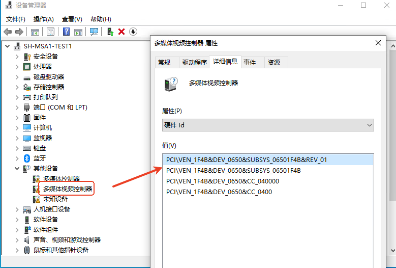
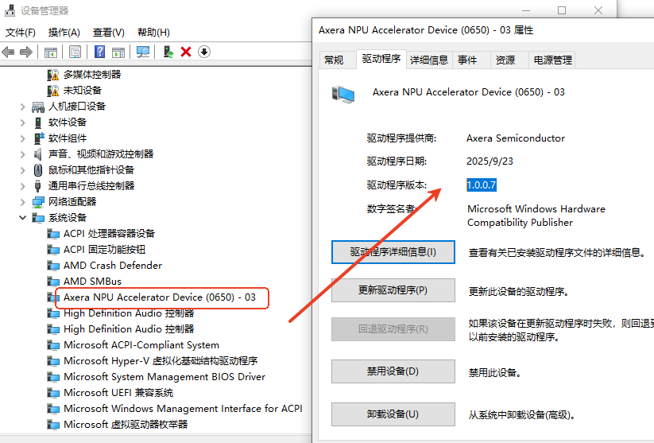
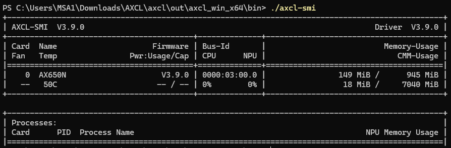

# Windows 驱动安装（Beta）

## 环境准备

### 版本要求

| Windows | 版本    |
| ------- | ------- |
| 10      | 22H2    |
| 11      | >= 23H2 |

:::{note}

- **Win+R**，输入**winver**，可以查询当前的Windows版本信息。
- 仅支持Win10 64位和Win11 64位系统。
- **Win+I** 打开**设置** > **更新和安全** > **Windows更新**，自动更新Windows版本，Window10推荐用 [微软更新助手](https://www.microsoft.com/zh-cn/software-download/windows10) 更新到22H2版本。
- 关闭系统睡眠功能：**Win+I** 打开**设置** > **系统** > **电源和睡眠** > 将**睡眠**更改为**从不**。

:::

### 环境准备

1. 建议关闭防护软件，避免被误杀。
2. 下载VS2022的运行时库**VC_redist.x64.exe**，[微软下载链接](https://aka.ms/vs/17/release/vc_redist.x64.exe)，管理员权限**安装**VC_redist.x64.exe。
3. **关机断电**后将设备接入主板，**不能带电操作**。
4. 开机后在**Win+R**, 输入**devmgmt.msc** ，打开**设备管理器**，在**其他设备**中应能识别未知的**多媒体视频控制器**，通过**属性**可以确认设备VENDOR 是1F4B。
   


## 安装

> 安装和卸载都需要管理员权限，需关闭系统睡眠功能。
>
> 如果系统已经安装AXCL旧版本，请先卸载！

1. Windows发布包 `axcl_win64_setup_Vx.x.x_yyyymmdd_NOxxxx.exe` 会自动安装驱动、动态链接库（含导入库）、可执行程序(比如axcl-smi.exe等)和sample示例源码，**管理员权限**运行发布包，按照提示安装即可。
2. 安装完之后请**重启系统**。
3. 重启后**Win+R**，输入**devmgmt.msc** ，打开**设备管理器**，在**系统设备**中应能发现**Axera NPU Accelerator Device**设备，如下图所示。
   
4. 进入安装路径`AXCL\axcl\out\axcl_win_x64\bin`目录，在Windows Terminal中执行**axcl-smi.exe**，显示如下：
   
5. 完成。

> [安装视频](res/ax650_win64_install.mp4)

## 卸载
  **管理员权限**双击安装目录下的**uninst.exe**，按照提示卸载。


## 编译

### 环境依赖

AXCL Windows SDK使用VS2022 C++17工具链编译，所需的环境依赖如下：

- [Visual Studio Community 2022](https://visualstudio.microsoft.com/zh-hans/vs/) ，安装[参考官方文档](https://learn.microsoft.com/zh-cn/visualstudio/install/install-visual-studio?view=vs-2022)，必选的组件：**使用C++的桌面开发**。

  :::{note}

  ​	- VS2022 安装所需硬盘空间比较大，请保证留有足够大的硬盘空间。
   - 版本号为v17.14.15

  :::

- [cmake](https://cmake.org/download/) ，版本高于3.20

- [ninja](https://github.com/ninja-build/ninja/releases)，推荐v1.31.1。将ninja.exe的路径配置到**系统环境变量 > Path**。

- [Python3](https://www.python.org/downloads/)

### 环境检查

```
PS D:\code> cd "C:\Program Files (x86)\Microsoft Visual Studio\Installer"
PS C:\Program Files (x86)\Microsoft Visual Studio\Installer> .\vswhere.exe -latest -property catalog_productDisplayVersion
17.14.15 (September 2025)

PS D:\code> ninja --version
1.13.1
PS D:\code> cmake --version
cmake version 4.1.1

CMake suite maintained and supported by Kitware (kitware.com/cmake).

PS D:\code> python --version
Python 3.11.5
```

### 示例编译

**axcl\scripts\build_win64.cmd**，编译sample。

```
PS D:\code\axcl\axcl.win64\axcl\scripts> .\build_win64.cmd
Build started at: 16:48:05.96

Detected 12 physical CPU cores
Checking for Ninja build system...
Found Ninja version: 1.13.1
========================================
CMake Windows x64 Build Script
========================================
Parallel Jobs :  12
Build Type    :  Release
Build System  :  ninja
Project Root  :  D:\code\axcl\axcl.win64\axcl
CMake Source  :  D:\code\axcl\axcl.win64\axcl\cmake
Build Dir     :  D:\code\axcl\axcl.win64\axcl\build\out\axcl_win_x64
Install Dir   :  D:\code\axcl\axcl.win64\axcl\out\axcl_win_x64
========================================

Detecting Visual Studio / Build Tools...
Found: D:\Program Files\Microsoft Visual Studio\2022\Community\VC\Auxiliary\Build\vcvarsall.bat
Generator: Visual Studio 17 2022

Configuring Visual Studio build environment...
Visual Studio environment configured successfully.
Creating build directory...

Running CMake configuration...
Using Ninja build system
CMAKE command: cmake -G "Ninja" -DCMAKE_BUILD_TYPE=Release -DCMAKE_INSTALL_PREFIX="D:\code\axcl\axcl.win64\axcl\out\axcl_win_x64" "D:\code\axcl\axcl.win64\axcl\cmake" -DCONFIG_BUILD_VERSION="V3.9.0"

-- The C compiler identification is MSVC 19.44.35217.0
-- The CXX compiler identification is MSVC 19.44.35217.0
-- Detecting C compiler ABI info
-- Detecting C compiler ABI info - done
-- Check for working C compiler: D:/Program Files/Microsoft Visual Studio/2022/Community/VC/Tools/MSVC/14.44.35207/bin/Hostx64/x64/cl.exe - skipped
-- Detecting C compile features
-- Detecting C compile features - done
-- Detecting CXX compiler ABI info
-- Detecting CXX compiler ABI info - done
-- Check for working CXX compiler: D:/Program Files/Microsoft Visual Studio/2022/Community/VC/Tools/MSVC/14.44.35207/bin/Hostx64/x64/cl.exe - skipped
-- Detecting CXX compile features
-- Detecting CXX compile features - done
-- Socket communication disabled on Windows (ZMQ not available)
-- COMPILE_USER : jingxiaoping
-- BUILD_VERSION: V3.9.0
-- BUILD_FFMPEG : OFF
-- BSP PATH: D:/code/axcl/axcl.win64/axcl/3rdparty/bsp
-- Performing Test CMAKE_HAVE_LIBC_PTHREAD
-- Performing Test CMAKE_HAVE_LIBC_PTHREAD - Failed
-- Looking for pthread_create in pthreads
-- Looking for pthread_create in pthreads - not found
-- Looking for pthread_create in pthread
-- Looking for pthread_create in pthread - not found
-- Found Threads: TRUE
-- Configured Windows version file: D:/code/axcl/axcl.win64/axcl/build/out/axcl_win_x64/logger/generated/axcl_logger_version.rc (version: 3.9.0)
-- Configured Windows version file: D:/code/axcl/axcl.win64/axcl/build/out/axcl_win_x64/sample/generated/axcl_sample_memory_version.rc (version: 3.9.0)
-- Configured Windows version file: D:/code/axcl/axcl.win64/axcl/build/out/axcl_win_x64/sample/generated/axcl_sample_runtime_version.rc (version: 3.9.0)
-- Configured Windows version file: D:/code/axcl/axcl.win64/axcl/build/out/axcl_win_x64/sample/generated/axcl_sample_sys_version.rc (version: 3.9.0)
-- Configured Windows version file: D:/code/axcl/axcl.win64/axcl/build/out/axcl_win_x64/sample/generated/axcl_run_usrworker_version.rc (version: 3.9.0)
-- Configured Windows version file: D:/code/axcl/axcl.win64/axcl/build/out/axcl_win_x64/sample/generated/axcl_sample_dmadim_version.rc (version: 3.9.0)
-- Configured Windows version file: D:/code/axcl/axcl.win64/axcl/build/out/axcl_win_x64/sample/generated/axcl_run_model_version.rc (version: 3.9.0)
-- Configured Windows version file: D:/code/axcl/axcl.win64/axcl/build/out/axcl_win_x64/sample/generated/axcl_lite_version.rc (version: 3.9.0)
-- Configured Windows version file: D:/code/axcl/axcl.win64/axcl/build/out/axcl_win_x64/sample/generated/axcl_ppl_version.rc (version: 3.9.0)
-- Configured Windows version file: D:/code/axcl/axcl.win64/axcl/build/out/axcl_win_x64/sample/generated/axcl_sample_transcode_version.rc (version: 3.9.0)
-- Configured Windows version file: D:/code/axcl/axcl.win64/axcl/build/out/axcl_win_x64/sample/generated/axcl_sample_hvcp_version.rc (version: 3.9.0)
-- Configured Windows version file: D:/code/axcl/axcl.win64/axcl/build/out/axcl_win_x64/sample/generated/axcl_sample_vdec_version.rc (version: 3.9.0)
-- Configured Windows version file: D:/code/axcl/axcl.win64/axcl/build/out/axcl_win_x64/sample/generated/axcl_ffmpeg_venc_version.rc (version: 3.9.0)
-- Configured Windows version file: D:/code/axcl/axcl.win64/axcl/build/out/axcl_win_x64/sample/generated/axcl_ffmpeg_vdec_version.rc (version: 3.9.0)
-- Configuring done (4.6s)
-- Generating done (0.2s)
-- Build files have been written to: D:/code/axcl/axcl.win64/axcl/build/out/axcl_win_x64

========================================
Building project (Release configuration)...
========================================
Using Ninja build system with 12 parallel jobs...
[96/96] Linking CXX executable out\axcl_ffmpeg_vdec.exe

========================================
Installing to D:\code\axcl\axcl.win64\axcl\out\axcl_win_x64...
========================================
[0/1] Install the project...-- Install configuration: "Release"
-- Installing: D:/code/axcl/axcl.win64/axcl/out/axcl_win_x64/lib/libcJSON.lib
-- Up-to-date: D:/code/axcl/axcl.win64/axcl/out/axcl_win_x64/bin/libspdlog.dll
-- Up-to-date: D:/code/axcl/axcl.win64/axcl/out/axcl_win_x64/bin/ffmpeg.exe
-- Up-to-date: D:/code/axcl/axcl.win64/axcl/out/axcl_win_x64/bin/ffplay.exe
-- Up-to-date: D:/code/axcl/axcl.win64/axcl/out/axcl_win_x64/bin/ffprobe.exe
-- Up-to-date: D:/code/axcl/axcl.win64/axcl/out/axcl_win_x64/bin/libavcodec-61.dll
-- Up-to-date: D:/code/axcl/axcl.win64/axcl/out/axcl_win_x64/bin/libavfilter-10.dll
-- Up-to-date: D:/code/axcl/axcl.win64/axcl/out/axcl_win_x64/bin/libavformat-61.dll
-- Up-to-date: D:/code/axcl/axcl.win64/axcl/out/axcl_win_x64/bin/libavutil-59.dll
-- Up-to-date: D:/code/axcl/axcl.win64/axcl/out/axcl_win_x64/bin/libpostproc-58.dll
-- Up-to-date: D:/code/axcl/axcl.win64/axcl/out/axcl_win_x64/bin/libswresample-5.dll
-- Up-to-date: D:/code/axcl/axcl.win64/axcl/out/axcl_win_x64/bin/libswscale-8.dll
-- Up-to-date: D:/code/axcl/axcl.win64/axcl/out/axcl_win_x64/bin/libiconv-2.dll
-- Up-to-date: D:/code/axcl/axcl.win64/axcl/out/axcl_win_x64/bin/libva.dll
-- Up-to-date: D:/code/axcl/axcl.win64/axcl/out/axcl_win_x64/bin/libva_win32.dll
-- Up-to-date: D:/code/axcl/axcl.win64/axcl/out/axcl_win_x64/bin/libwinpthread-1.dll
-- Up-to-date: D:/code/axcl/axcl.win64/axcl/out/axcl_win_x64/bin/zlib1.dll
-- Installing: D:/code/axcl/axcl.win64/axcl/out/axcl_win_x64/lib/libaxcl_logger.lib
-- Installing: D:/code/axcl/axcl.win64/axcl/out/axcl_win_x64/bin/libaxcl_logger.dll
-- Installing: D:/code/axcl/axcl.win64/axcl/out/axcl_win_x64/bin/axcl_sample_memory.exe
-- Installing: D:/code/axcl/axcl.win64/axcl/out/axcl_win_x64/bin/axcl_sample_runtime.exe
-- Installing: D:/code/axcl/axcl.win64/axcl/out/axcl_win_x64/bin/axcl_sample_sys.exe
-- Installing: D:/code/axcl/axcl.win64/axcl/out/axcl_win_x64/bin/axcl_run_usrworker.exe
-- Installing: D:/code/axcl/axcl.win64/axcl/out/axcl_win_x64/bin/axcl_sample_dmadim.exe
-- Installing: D:/code/axcl/axcl.win64/axcl/out/axcl_win_x64/bin/axcl_run_model.exe
-- Installing: D:/code/axcl/axcl.win64/axcl/out/axcl_win_x64/lib/libaxcl_lite.lib
-- Installing: D:/code/axcl/axcl.win64/axcl/out/axcl_win_x64/bin/libaxcl_lite.dll
-- Installing: D:/code/axcl/axcl.win64/axcl/out/axcl_win_x64/lib/libaxcl_ppl.lib
-- Installing: D:/code/axcl/axcl.win64/axcl/out/axcl_win_x64/bin/libaxcl_ppl.dll
-- Installing: D:/code/axcl/axcl.win64/axcl/out/axcl_win_x64/bin/axcl_sample_transcode.exe
-- Installing: D:/code/axcl/axcl.win64/axcl/out/axcl_win_x64/bin/axcl_sample_hvcp.exe
-- Installing: D:/code/axcl/axcl.win64/axcl/out/axcl_win_x64/bin/axcl_sample_vdec.exe
-- Installing: D:/code/axcl/axcl.win64/axcl/out/axcl_win_x64/bin/axcl_ffmpeg_venc.exe
-- Installing: D:/code/axcl/axcl.win64/axcl/out/axcl_win_x64/bin/axcl_ffmpeg_vdec.exe


========================================
Build completed successfully
========================================
Build started : 16:48:05.96
Build ended   : 16:48:33.25
Build elapsed : 00:00:27.29
Build Version : V3.9.0
Build Type    : Release
Build System  : ninja
Generator     : Visual Studio 17 2022
Build Dir     : D:\code\axcl\axcl.win64\axcl\build\out\axcl_win_x64
Install Dir   : D:\code\axcl\axcl.win64\axcl\out\axcl_win_x64

Binaries and libraries have been installed to:
  D:\code\axcl\axcl.win64\axcl\out\axcl_win_x64
PS D:\code\axcl\axcl.win64\axcl\scripts>
```


## 应用开发

-  推荐使用**msvc17**(即VS2022)编译工具链，不推荐mingw
-  C++标准17
-  运行库链接/MD或者/MDd，不推荐/MT和/MTd

### 目录结构

#### 驱动

- 驱动axcl_pcie.sys：C:\Windows\System32\drivers
- 设备固件和命名路径：C:\\Windows\\System32\\drivers\ax650_card.pac  # 固定路径和文件名

#### AXCL

```
axcl
   |- 3rdparty                           # 第三方库
   |- build                              # build 编译输出目录
   |- cmake                              # cmake
   |- out                                # 编译install目录
        |- axcl_win_x64
                     |- bin              # axcl-smi.exe、sample和动态库
                     |- drv              # 驱动文件
                     |- include          # 头文件
                     |- lib              # 动态库导入库
   |- sample                             # 示例源码
   |- toolkit                            # 辅助类
```


## 辅助工具

> [Windows工具包](https://hf-mirror.com/AXERA-TECH/testdata-boxdemo/resolve/main/windows%20develop%20kits.zip)
>
> 建议右键复制链接地址，在浏览器新窗口下载。

1. Windows **lspci** : [pciutils-3.5.5-win64.zip](https://wiki.aixin-chip.com/download/attachments/220464657/pciutils-3.5.5-win64.zip?version=1&modificationDate=1758526243666&api=v2) (需管理员权限执行)

2. [RWEverything](https://rweverything.com/download/)（类似Linux devmem）

   - [Win11无法使用RWEverything的解决方法](https://zhuanlan.zhihu.com/p/681795421)： 在“**设置**”中搜索框输入“**内核**”，打开“**内核隔离**”页面，将“**内存完整性**”和“**易受攻击的驱动程序列表**”全部关闭，重启计算机
   - 如果仍然无法使用，在注册表 `HKEY_LOCAL_MACHINE\SYSTEM\CurrentControlSet\Control\CI\Config` 添加
     Key:  **VulnerableDriverBlocklistEnable** ,  **REG_DWORD**,  Value:  **1**

3. **md5**： `certutil.exe -hashfile yourfile MD5`

4. 关闭驱动签名验签（**仅驱动调试**）

   ```
   bcdedit /set testsigning on
   bcdedit /set nointegritychecks on
   ```


## FAQ

待补充
